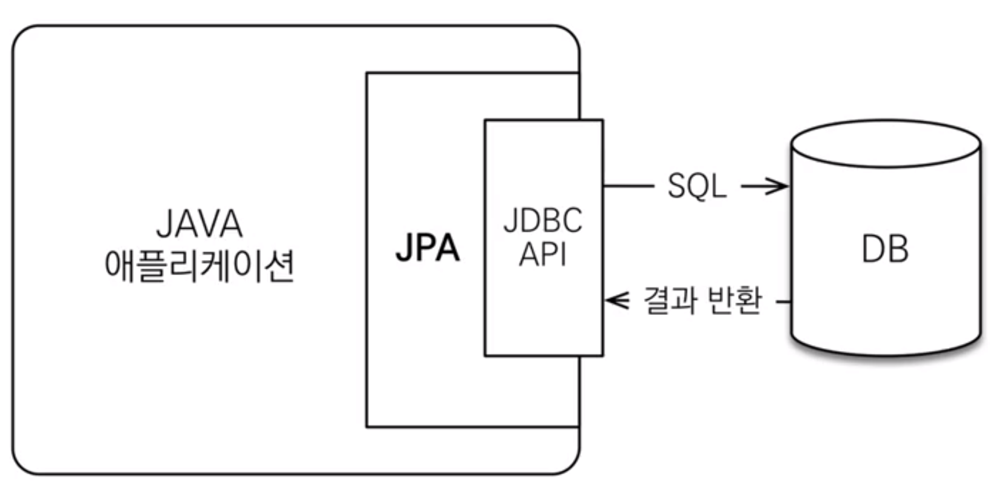
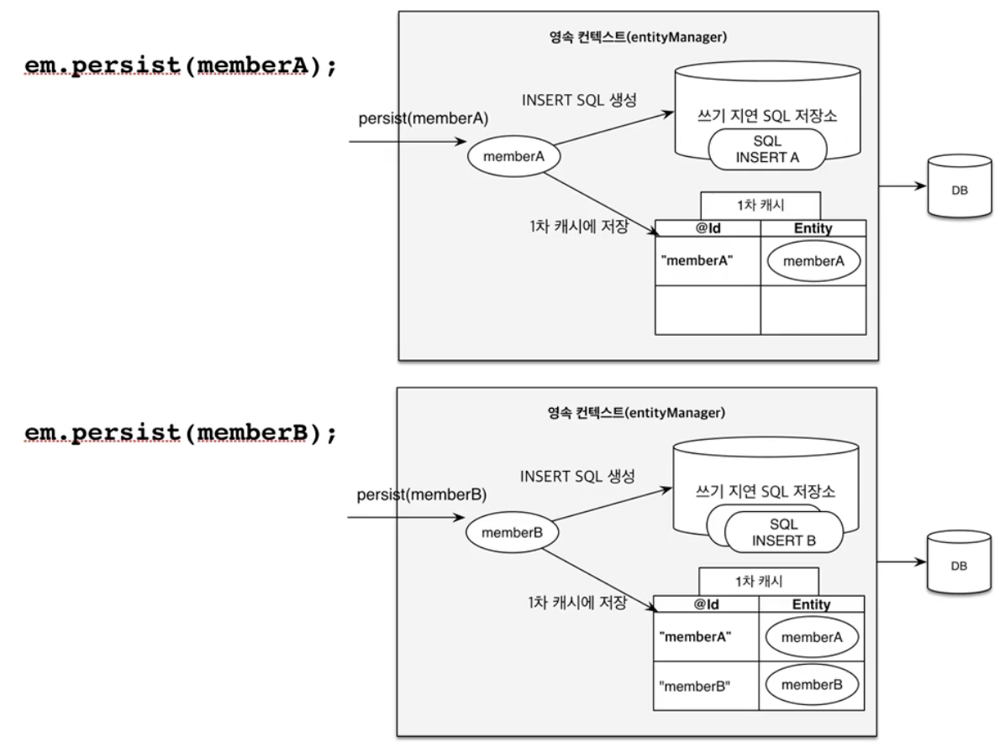
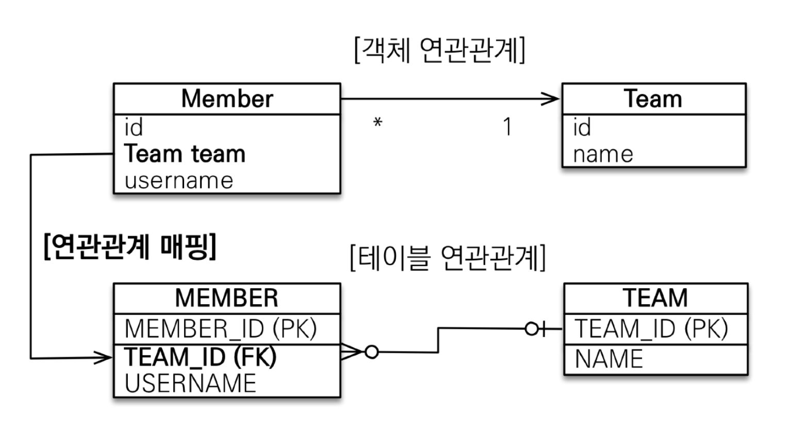
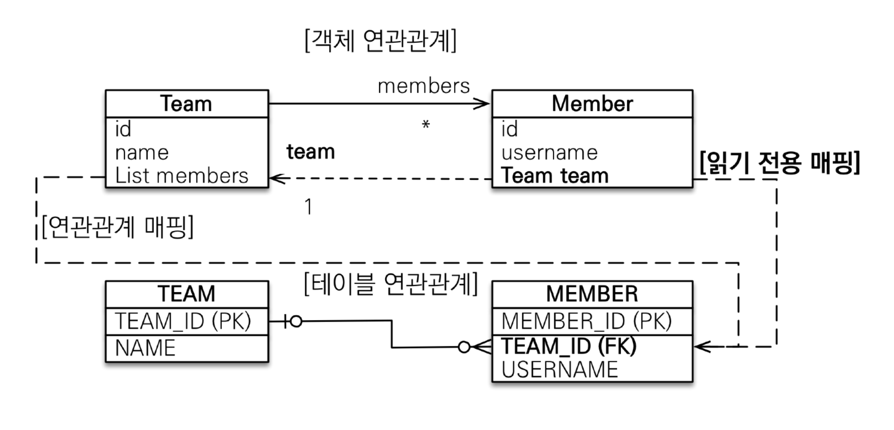
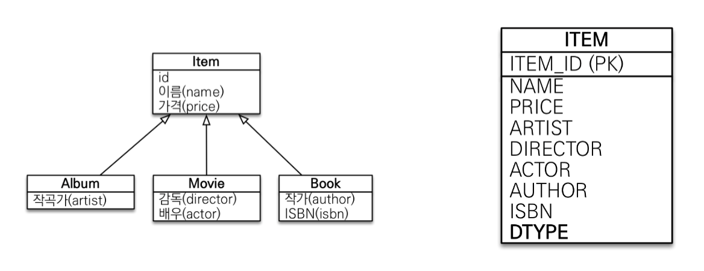
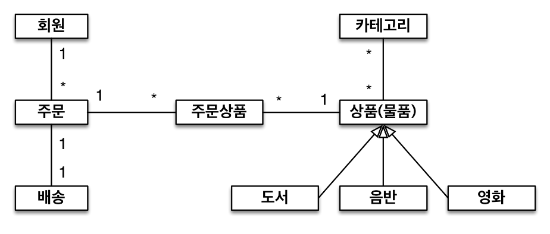
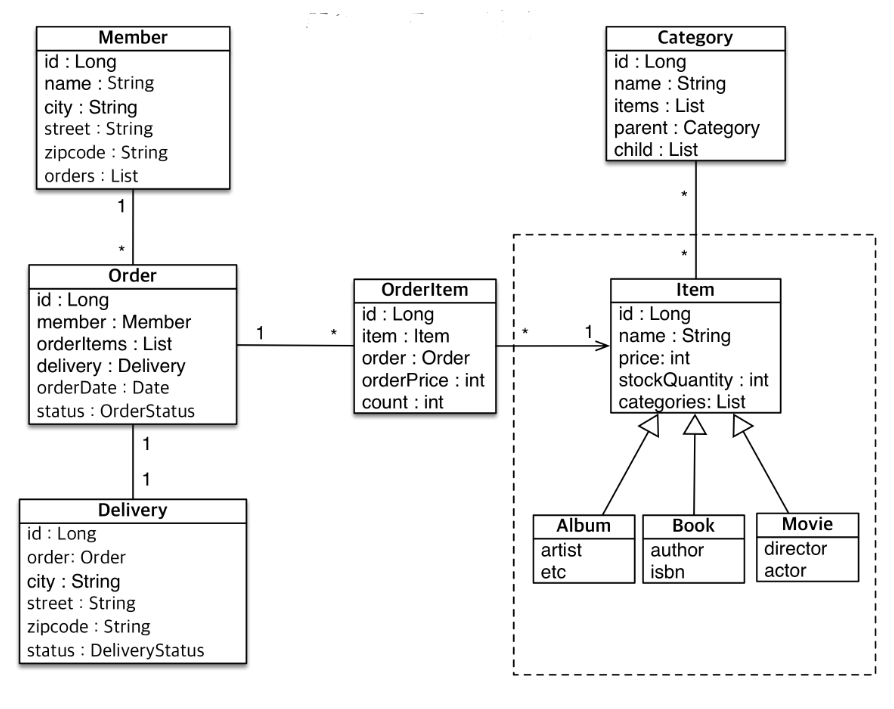

# 자바 ORM 표준 JPA 프로그래밍 - 기본편 이해
[강의](https://www.inflearn.com/course/ORM-JPA-Basic)

## **강좌 소개**
<details>
<summary>보기</summary>

- 왜 JPA를 사용하는가
  - 기존에는 개발자가 SQL mapper 역할을 함
  - JPA는 SQL을 자동으로 생성해 줌
    - DB에 종속되지 않게 개발할 수 있음
      ∵ 사용하는 DB에 맞게 쿼리를 자동으로 생성(dialect)
<br>

- 실무에서는 테이블의 갯수가 많고, 사용하는 객체가 복잡해 어려울 수 있음; 아래의 연습이 필요
  - 객체와 테이블 설계 매핑
    - 객체, 테이블 설계 및 매핑
    - PK, FK 매핑
    - 1:N, N:1, 1:1, N:M 매핑
  <br>
  
  - JPA 내부 동작 방식 이해
    - JPA가 어떤 SQL을 생성하는가
    - JPA가 언제 SQL을 실행하는가
</details>
<br>

---
## **JPA 소개**
### SQL 중심적인 개발의 문제점
<details>
<summary>보기</summary>

- RDB : 현 DB의 헤게모니
  - RDB에 정보를 저장할 때 객체가 가진 정보를 SQL로 변환하여 RDB에 저장
  - 개발자가 객체와 DB entity를 매핑시킴
  - 객체를 RDB에 저장함에 있어 SQL 의존적 개발을 피하기 어려움
  <br>

- 객체와 RDB의 차이
  1. 상속
    
     - 객체의 상속 관계를 RBD는 슈퍼타입 - 서브타입 관계로 풀어냄
     - insert : DB의 두 테이블에 각각 insert
     - select : join 해서 조회 후 각각의 객체를 생성하게 될 수도🤬
  <br>

  2. 연관관계
     - 객체는 참조, 테이블은 FK를 사용
     - 객체를 DB 테이블에 맞춰 모델링한다면, FK로 사용되는 값을 변수로 가지고 있어야 함
       -> 객체를 다룰 때는 부적절함
         ```
         class Member {
            String id;
            Long teamId;  // TEAM_ID FK컬럼
            String username;
         }
         class Team {
            Long id;
         }
         INSERT INTO MEMBER (MEMBER_ID, TEAM_ID, USERNAME) VALUES...
         ``` 
         <br>

     - 참조 형식으로 모델링한다면, 쿼리 시 파라미터 매핑 등에서 굉장히 번거로워질 수도 있음
         ```
         class Member {
            String id;
            Team team;  // 참조를 통한 연관관계
            String username;
         }
         class Team {
            Long id;
         }
         ``` 
        <br>

     - 엔티티 신뢰 문제
       - 객체는 자유롭게 내/외부의 객체 등으로 탐색할 수 있어야 함
       - 처음 실행하는 SQL에 따라 탐색 범위가 결정됨
         ```
         SELECT M.*, T.*
           FROM MEMBER M
           JOIN TEAM T
             ON M.TEAM_ID = T.TEAM_ID;

         member.getTeam();  // ok
         member.getOrder(); // NPE
         ```
       - 다음 계층의 데이터를 믿을 수 없으면 직접 들어가서 확인해 봐야 함
       - 그렇다고 모든 객체를 미리 로딩할 수는 없음
         ∵ 불필요한 데이터를 조회하며 쿼리 성능을 크게 떨어뜨림
       - 상황에 따른 조회 메서드를 여러 벌 만들게 됨
  <br>

  3. 데이터 타입
  4. 데이터 식별 방법
      ```
      Long memberId = 1;
      Member member1 = dao.getMember(memberId);
      Member member2 = dao.getMember(memberId);
      member1 == member2  // false
      ```
    <br>

- 객체답게 모델링 할수록 매핑 작업이 늘어남
- 객체를 JAVA 컬렉션에 저장하듯이 DB에 저장하면 해결할 수 있음 => JPA
</details>
<br>

---
### JPA 소개
<details>
<summary>보기</summary>

- JAVA의 ORM(Object-Relational Mapping) 기술 표준
  - 객체는 객체대로, RDB는 RDB 대로 설계 후 ORM으로 중간에서 매핑
<br>

- 애플리케이션과 JDBC 사이에서 동작
  |      |                                                      |
  | ---- | ---------------------------------------------------- |
  | 동작 |  |
  | 저장 |  |
  | 조회 |  |
<br>

- SQL 중심의 개발에서 객체 중심으로 개발 가능
  - 벤더 독립성
  - 객체 RDB의 패러다임 불일치 해소
    - 상속, 연관관계, 객체 그래프 탐색, 비교 등
    ∵ 개발자가 jpa 메서드를 사용하면, 그에 맞게 JPA가 SQL을 작성하기 때문
<br>

- CRUD
  - 저장 : em.**persist**(member);
  - 조회 : Member member = em.**find**(memberId);
  - 수정 : member.**setName**("memberA");
  - 삭제 : em.**remove**(member);
<br>

- 유지보수에 용이
  - 컬럼이 변경되더라도 객체의 필드만 수정하면 되고, SQL은 따로 처리가 필요하지 않음
<br>

- 신뢰할 수 있는 데이터 계층
  - **지연 로딩**을 이용한 자유로운 객체 그래프 탐색이 가능
<br>

- 동일 트랜잭션 내에서 조회한 엔티티는 같음을 보장 (≒ Java 컬렉션)
- 성능 최적화
  - 1차 캐시 동일성 보장
    - 같은 트랜잭션 내에서 같은 객체 반환(캐싱)
    - 1번째 조회는 쿼리를 날리고, 다음부터는 메모리에서 가져옴
  <br>

  - 트랜잭션을 지원하는 쓰기 지연(transactional write-behind)
    - **트랜잭션 커밋 시점**까지 INSERT SQL을 모아둠
    - JDBC Batch SQL 기능을 사용해 **한 번에 전송**
    - UPDATE, DELETE의 경우, 트랜잭션 커밋 시 SQL을 실행하고 커밋
    - 이 때, 트랜잭션 커밋 전까지 DB에 **Row Lock이 걸리지 않음**
  <br>

  - 지연 로딩(Lazy)과 즉시 로딩(Eager)
    
    - 지연 로딩 : 객체가 **실제 사용될 때** 로딩
    - 즉시 로딩 : JOIN SQL로 연관된 객체까지 한 번에 **미리 조회**
    - 연관된 객체의 사용빈도를 고려하여 선택

</details>
<br>

---
## **JPA 시작하기**
### Hello JPA - 프로젝트 생성
<details>
<summary>보기</summary>

- DB : H2
- JPA 설정
  - persistentce.xml에 JPA 설정 정보 입력
  - /META-INF/persistentce.xml로 위치가 지정되어 있음
  - 보통 DB 하나 당 persistence-unit 하나를 지정해서 사용
  - 필수 속성 : DB 정보(driver, user, pw, url, dialect 등)

</details>
<br>

---
### Hello JPA - 애플리케이션 개발
<details>
<summary>보기</summary>

#### EntityManagerFactory, EntityManager
- EntityManagerFactory(이하 emf) 로부터 EntityManager(이하 em) 를 획득하여 사용
- 사용한 emf, em 는 `close()`로 반환해야 함
  
- `em.getTransaction()`으로 트랜잭션 객체 획득 후 `begin()`으로 트랜잭션 시작
  - `commit()` 또는 `rollback()`으로 트랜잭션을 종료해야 함
<br>

- **!주의**
  - emf는 **하나만 생성**해서 앱 전체에서 공유
  - em은 **쓰레드간 공유하면 안됨**(반드시 반환)
  - JPA의 모든 데이터 변경은 **트랜잭션 안**에서 실행
<br>
  
#### Entity
- 클래스에 `@Entity` 애노테이션으로 JPA가 관리할 객체임을 명시
- 필드에 `@Id` 애노테이션으로 해당 필드를 DB의 PK와 매핑
- `@Table`, `@Column` 등의 애노테이션은 객체의 필드명과 DB의 컬럼명이 다를 경우 name 엘리먼트로 명시
<br>

#### JPQL
- JPA가 제공하는 SQL을 추상화한 쿼리 언어
  ∴ 특정 DB SQL에 의존하지 않음
- SELECT, FROM, WHERE, GROUP BY, HAVING, JOIN 지원
- `em.createQuery()` 파라미터로 jpql을 작성해 SQL을 수행할 수 있음
- 검색 쿼리 등에서도 테이블이 아닌 **엔티티 객체를 대상**으로 검색
  - 모든 DB 데이터를 객체로 변환할 수 없음
  - 결국 검색 조건이 포함된 SQL을 사용해야 하므로 JPQL을 사용

</details>
<br>

---
## **영속성 관리 - 내부 동작 방식**
### 영속성 컨텍스트 1
<details>
<summary>보기</summary>

#### **영속성 컨텍스트**
  - 엔티티를 영구 저장하는 환경(논리적 개념)
  - em을 통해서 영속성 컨텍스트에 접근
  - `em.persist(entity);`
<br>

#### 엔티티의 생명주기
  ```
  Member member = new Member();
  member.setId("member1");
  member.setName("memberA");    // 비영속

  em.getTransaction().begin();
  em.persist(member);           // 영속
  em.detach(member);            // 준영속
  ```
   - 비영속 (new / transient)
  - 영속 (managed)
  - 준영속 (detached)
  - 삭제 (removed)

</details>
<br>

---
### 영속성 컨텍스트 2
<details>
<summary>보기</summary>

#### 엔티티 조회, 1차 캐시
  - 1차 캐시

    |    @Id    | Entity |
    | :-------: | :----: |
    | "member1" | member |

  - `em.find(Member.class, "member1");`
    1. 1차 캐시에서 조회 -> 조회 결과 존재
    2. 조회 결과를 반환
    <br>
    
  - `em.find(Member.class, "member2");`
    1. 1차 캐시에서 조회 -> 조회 결과 없음
    2. DB 조회
    3. DB 조회 결과를 1차 캐시에 저장
    4. 조회 결과를 반환
    <br>

  - 1차 캐시의 성능적 이익은 크지 않음
    - em은 보통 트랜잭션 단위로 존재하고, 요청이 종료 될 때 같이 종료; 1차 캐시도 삭제
    - 하나의 트랜잭션 안에서만 이익을 볼 수 있는 구조
    - JPA(또는 Hibernate)에서 애플리케이션 전쳉에서 공유하는 캐시는 2차 캐시라 함
<br>

#### 영속 엔티티의 동일성 보장
```
Member a = em.find(Member.class, "member1");
Member b = em.find(Member.class, "member1");

System.out.println(a == b); // true
```
- 1차 캐시를 이용하여 같은 참조를 가진 객체처럼 비교
- 반복 가능한 읽기(REPEATABLE READ) 등급의 트랜잭션 격리 수준을 DB가 아닌 애플리케이션에서 제공
<br>

#### 엔티티 등록
- 트랜잭션을 지원하는 쓰기 지연
  |                    `em.persist()`                    |                    `tx.commit()`                     |
  | :--------------------------------------------------: | :--------------------------------------------------: |
  |  |  |
    - `em.persist()` 때 SQL을 생성해서 쓰기 지연 SQL 저장소에 보관
    - 트랜잭션 commit 직전에 SQL을 flush(DB로 전송)하고 DB에서 commit
    - 예외의 경우가 존재함 (`GenerationType.SEQUENCE)`
    - 버퍼링 가능 : Hibernate의 경우 hibernate.jdbc.batch.size 옵션에서 설정한 만큼 쿼리를 보내고 DB commit
<br>

#### 엔티티 수정
- 변경 감지(dirty checking)
  
  - 스냅샷 : 엔티티를 읽어온 최초 시점의 상태를 보관한 것
  - `em.flush()` 할 때(트랜잭션 커밋 시점) 엔티티와 스냅샷을 비교
  - 만약 엔티티와 스냅샷에 차이가 있다면 쓰기 지연 SQL 저장소에 UPDATE 쿼리 추가
<br>

#### 엔티티 삭제
- `em.remove(entity)`로 삭제 
- 같은 방식으로 쓰기 지연 SQL 저장소에 DELETE 쿼리 생성 후 flush

</details>
<br>

---
### 플러시
<details>
<summary>보기</summary>
#### 정의 : 영속성 컨텍스트의 변경 내용을 DB에 반영하는 것
<br>

#### 트랜잭션 commit 시 플러시 발생
- 변경 감지
- 변경 감지한 결과로 수정된 엔티티에 대한 UPDATE 쿼리를 쓰기 지연 SQL 저장소에 등록
- 쓰기 지연 SQL 저장소의 쿼리(등록, 수정, 삭제)를 DB에 전송
<br>

#### 플러시 하는 방법
- `em.flush()`
  - 직접 호출
  - 커밋 전 미리 DB에 반영, 전송되는 쿼리 확인, 테스트 용도로 강제 호출해서 사용
  - 플러시 한다고 해서 1차 캐시가 지워지는 것은 아님
- 트랜잭션 커밋 : 플러시 자동 호출
- JPQL 쿼리 실행
  - 플러시 자동 호출
  - JPQL은 즉시 DB에서 실행되기 때문에 실행 전 영속성 컨텍스트의 상태를 DB에 동기화하기 위함
  - ex) `em.persist(memberC)` 호출 후 JPQL로 전체 회원을 조회한다면, DB에서 INSERT가 실행되어야 memberC의 정보도 조회할 수 있음
<br>

#### 플러시 모드 옵션 : `em.setFlushMode(FlushModeType flushModeType)`
- FlushModeType.AUTO : 커밋이나 쿼리를 실행할 때 플러시(default)
- FlushModeType.COMMIT : 커밋할 때만 플러시
<br>

#### **!주의**
- 플러시는 ***영속성 컨텍스트를 비우지 않음***
- 영속성 컨텍스트의 **변경내용을 DB에 동기화**
- 트랜잭션이라는 작업 단위가 중요하므로, 커밋 직전에만 동기화하면 됨

</details>
<br>

---
### 준영속 상태
<details>
<summary>보기</summary>

#### 준영속 상태로 만드는 방법
- `em.detach(entity)` : 특정 엔티티를 준영속 상태로 전환
- `em.clear()` : 영속성 컨텍스트를 초기화
- `em.close()` : 영속성 컨텍스트 종료
- 테스트 환경에서 사용, 단순한 로직에서는 사실상 필요 없음

</details>
<br>

---
### 정리
#### 걍 정리였음
<br>

---
## **엔티티 매핑**
### 객체와 테이블 매핑
<details>
<summary>보기</summary>

#### 엔티티 매핑 소개
- 객체-테이블 매핑 : `@Entity`, `@Table`
- 필드-컬럼 매핑 : `@Column`
- 기본 키 매핑 : `@Id`
- 연관관계 매핑 : `@ManyToOne`, `@JoinColumn` 등
<br>

#### @Entity
- 클래스에 붙이며, JPA가 엔티티로 관리한다는 의미
- JPA로 테이블과 매핑할 클래스에는 **필수**
- **!주의**
  - **기본 생성자 필수** (protected까지 허용)
  - fianl 클래스, enum, interface, inner 클래스에는 사용하지 않음
  - 저장할 필드에는 final 

</details>
<br>

---
### 데이터베이스 스키마 자동 생성 TODO
<details>
<summary>보기</summary>


</details>
<br>

---
### 필드와 컬럼 매핑 TODO
<details>
<summary>보기</summary>


</details>
<br>

---
### 기본 키 매핑
<details>
<summary>보기</summary>

#### 기본 키 매핑 애노테이션
- `@Id` : `@Id`만 사용 시 값을 직접 할당
- `@GeneratedValue(strategy = GenerationType.AUTO)` : 값 자동 생성
  - IDENTITY : DB에 위임 / MySQL
  - SEQUENCE : DB 시퀀스 사용, `@SequenceGenerator` 필요 / ORACLE
  - TABLE : 키 생성용 테이블 사용, `@TableGenerator` 필요 / 모든 DB 가능
  - AUTO : 방언에 따라 자동 지정, default

#### GenerationType.IDENTITY
- DB에 기본 키 생성 위임
- MySQL, PostgreSQL, SQL Server, DB2 등
  - ex) MySQL의 AUTO_INCREMENT 속성
- 단, AUTO_INCREMENT는 DB에서 INSERT가 실행되어야 ID를 얻을 수 있음
  - `em.persist()`  시점에 즉시 INSERT를 실행시켜 PK 값을 획득

#### GenerationType.SEQUENCE
- DB 오브젝트인 시퀀스 사용
- Oracle, PostgreSQL, DB2, H2 DB 등
- 클래스에 `@SequenceGenerator`를 선언해 매핑
  - ```
    @Entity
    @SequenceGenerator(
          name = "MEMBER_SEQ_GENERATOR",
          sequenceName = "SEQ_MEMBER",
          intitialValue = 1,
          allocationSize = 1)
    public class Member {

      @Id
      @GeneratedValue(strategy = GenerationType.SEQUENCE,
                      generator = "MEMBER_SEQ_GENERATOR")
      private Long id;
    }
    ```
</details>
<br>

---
### 실전 예제 1 - 요구사항 분석과 기본 매핑
<details>
<summary>보기</summary>

#### 기능 목록
- 회원 기능
  - 회원 등록
  - 회원 조회
<br>

- 상품 기능
  - 상품 등록
  - 상품 수정
  - 상품 조회
<br>

- 주문 기능
  - 상품 주문
  - 주문내역 조회
  - 주문 취소
<br>

#### 테이블 설계

- ORDERS - ITEM 의 다대다 관계를 중간에 ORDER_ITEM 테이블을 이용해 일대다로 매핑
<br>

#### 엔티티 설계와 매핑

<br>

#### 컬럼명 매핑
- Spring legacy 에서는 Camel case를 Snake case로 자동 변환하지 않음
  - 따로 설정해야 함
  - `@Column(name="MEMBER_ID")` 로 직접 매핑할 DB 컬럼을 명시할 수 있음
<br>

#### 엔티티 정보 설정
- 엔티티 클래스에서 제약조건, 인덱스, 컬럼의 크기 등을 설정할 수 있음
- DB를 조회하지 않고 파악할 수 있다는 장점
- 예시
  - 데이터 크기 : `@Column(length=10)` 등
  - 제약조건, 인덱스 : `@Table`의 uniqueConstraints, indexes element(`indexes = @Index()`) 등
<br>

#### 데이터 중심 설계
- 객체 설계를 테이블 설계에 맞춘 방식
  - ex) Order 클래스에 memberId를 필드로 선언
- 객체의 그래프 탐색이 불가능
- 사실상 참조가 없음
- 외래 키가 아닌 객체를 필드로 선언해야 함
<br>

</details>
<br>

---
## 연관관계 매핑 기초
### 단방향 연관관계
<details>
<summary>보기</summary>

#### 용어 이해
- 방향(dirction) : 단방향, 양방향
- 다중성(multiplicity) : 다대일, 일대다, 일대일, 다대다
- **연관관계의 주인(owner)** : 객체 양방향 관계는 관리 주인이 필요
<br>

#### 예제 시나리오
- 회원과 팀이 있음
- 회원은 하나의 팀에만 소속됨
- 회원과 팀은 다대일
<br>

#### 객체를 테이블에 맞추어 모델링(데이터 중심)

- 객체에 연관관계가 없음
- Member 객체에 외래 키 값을 그대로 가져옴
- 문제점
  - member를 persist 하기 위해서는 team을 조회해서 id를 가져온 뒤 member에 set 해줘야 함
  - member의 team을 조회하기 위해서는 member의 teamId를 가져와서 다시 team을 조회해야 함
  - 테이블은 외래 키로 조인해서 연관 테이블을 찾고, 객체는 참조를 사용해서 연관된 객체를 찾는 차이가 있기 때문
<br>

#### 객체 지향 모델링(단방향 연관관계)

- member 객체에서 team을 바로 가져올 수 있음

</details>
<br>

---
### 양방향 연관관계와 연관관계의 주인 1 - 기본
<details>
<summary>보기</summary>

#### 양방향 매핑

- Team <-> Member(List) 양방향으로 객체 그래프 탐색 가능
- Member는 단방향 매핑과 동일하게 작성
- Team에 `List<Member> members` 필드를 추가
  - `@OneToMany(mappedBy = "team")` 애노테이션 필요
<br>

#### 객체와 테이블이 관계를 맺는 차이
- 객체 연관관계 : 2개
  - 회원 -> 팀 (단방향)
  - 팀 -> 회원 (단방향)
  - 객체의 양방향 연관관계는 **사실상 2개의 단방향 관계**
    - 던방향 매핑에서 반대방향으로 조회(객체 그래프 탐색))하는 기능만 추가
  - 객체를 양방향으로 참조하려면 **단방향 연관관계 2개**가 필요
<br>

- 테이블 연관관계 : 1개
  - 회원 <-> 팀 (양방향)
  - **외래 키 하나**로 양방향 연관관계를 가짐
<br>

#### 딜레마 : 둘 중 하나로 외래 키를 관리해야 한다

- 회원의 팀 정보가 변경될 때 (= 팀의 회원목록이 바뀔 때)
- DB에서 MEMBER 테이블의 외래 키(TEAM_ID)는 어떤 기준으로 UPDATE 해야 하는가? 
  = Member, Team 객체 중 어디에서 외래 키를 관리해야 하는가?
    1. Member의 team을 변경
    2. Team의 members를 변경
  - 사실 둘 다 가능
<br>

#### 연관관계의 주인(Owner)
- 양방향 매핑 규칙
  - 객체의 두 관계 중 하나를 연관관계의 주인으로 지정
  - 연관관계의 주인만 외래 키를 관리(등록, 수정)
  - 주인이 아닌 쪽은 읽기만 가능
  - 주인은 mappedBy 속성 지정 안함
  - 주인이 아닌 객체는 mappedBy 속성으로 주인을 지정
  <br>

#### 누구를 주인으로? (가이드)
- 외래 키가 있는 곳을 주인으로 정해라(= N:1 관계에서 N 쪽)
- 예시
  - 자동차(Car.wheels) - 바퀴 관계에서 바퀴(Wheel.car)에 주인을 설정
  - 이 경우에는 Member.team이 연관관계의 주인이 됨
  - Team.members를 주인으로 설정한다면?
    - 가능(JPA 짬킹 한정)
    - Team을 다뤘는데 MEMBER 테이블의 UPDATE 쿼리가 나가는 등의 문제의 소지가 있음(성능 이슈)
  <br>

- 연관관계의 주인은 비즈니스적으로 중요한 개념은 아님
<br>

</details>
<br>

---
### 양방향 연관관계와 연관관계의 주인 2 - 주의점, 정리
<details>
<summary>보기</summary>

#### 연관관계의 주인에 값을 입력하지 않음
```
Team team = new Team();
team.setName("teamA");
team.getMembers().add(member);
em.persist(team);

Member member = new Member();
member.setUsername("member1");
em.persist(member);

em.flush();
em.clear();

tx.commit();
```
- `team.getMembers().add()` 로 Member를 리스트에 추가해도 DB에는 MEMBER의 TEAM_ID에 FK가 들어가지 않음 (1)
- `member.setTeam()` 으로 Member에서 Team을 참조해야 MEMBER테이블에도 정상적으로 반영됨 (2)
    ∵ 연관관계의 주인은 Member이기 때문에, (1)은 DB에 영향을 주지 못함 
  <br>

- (1)을 하지 않더라도 JPA는 지연 로딩을 통해 연관된 Member의 목록을 조회할 수 있음
  - 단, **flush 되지 않고 1차 캐시에서 팀을 가져올 경우** DB에서 조회하지 않기 때문에 추가한 Member가 `getMembers()`에서 조회되지 않을 수 있음
<br>

- 객체 관계를 고려하면 (1), (2) 모두 해주는 것이 맞음
  - 하나만 하고 까먹기 쉽기 때문에 **연관관계 편의 메서드**를 만들어 사용 권장
  - `Team.addMember(Member member)` 또는 `Member.changeTeam(Team team)` 등 상황에 따라 택1
<br>

#### 양방향 매핑 시 무한 루프 주의
- `toString()`, lombok, JSON 생성 라이브러리
- 두 객체가 서로 참조할 때, `toString()`에서 참조하는 객체가 다시 `toString()`을 호출하는 경우
- JSON 생성 라이브러리에서는 **엔티티를 반환하지 말 것**
  - DTO로 변환해서 반환하는 것을 권장
<br>

</details>
<br>

---
### 실전 예제 2 - 연관관계 매핑 시작
<details>
<summary>보기</summary>

#### 테이블 구조

<br>

#### 객체 구조

- 참조를 사용하도록 변경
<br>

#### 매핑
- 단방향 관계를 우선적으로 매핑, 이후 필요 시 양방향 매핑
- 외래 키를 가진 객체에서 연관관계의 주인을 설정(`@JoinColumn`)
- 외래 키를 필드로 가지지 않고, 객체를 필드로 가짐
<br>

#### 설계
- 회원의 주문 목록을 가져올 경우
  - ORDER에서 MEMBER_ID를 이용해 조회하는 것이 자연스러움
  - Member에서  `List<Order>`로 주문 목록을 가져오고 있다면, 관심사를 제대로 끊어내지 못한 것일 수 있음
  <br> 

- 주문은 연관된 상품 목록을 필요로 할 확률이 높음
  - 비즈니스적으로 의미가 클 수 있으므로 양방향 매핑
  <br>

- Member.orders, Order.orderItems는 없어도 문제 없음
  - 단방향으로도 테이블 간 매핑은 완성되었기 때문
  - 개발상의 편의, 일괄 조회 등이 필요할 때 사용(JPQL 등)
<br>

</details>
<br>

---
## 다양한 연관관계 매핑
### 다대일 [N:1]
<details>
<summary>보기</summary>

#### 연관관계 매핑 시 고려사항 3가지
- 다중성
  - `@ManyToOne` / `@OneToMany` / `@OneToOne` / `@ManyToMany`
  - `@ManyToMany`는 거의 쓰이지 않음
<br>

- 단방향, 양방향
  |          테이블          |                     객체                     |
  | :----------------------: | :------------------------------------------: |
  | 외래 키 하나로 양쪽 join |       참조용 필드가 있는 쪽으로만 참조       |
  |      방향 개념 없음      | 한쪽만 참조하면 단방향, 서로 참조하면 양방향 |
<br>

- 연관관계의 주인
  - 외래 키를 관리하는 참조
  - 테이블은 **외래 키 하나**로 두 테이블이 연관관계를 맺음
  - 객체의 양방향 관계는 사실 **단방향 2개**
  - 따라서 참조도 2군데가 있어 둘 중 ***테이블의 외래 키를 관리할 곳을 지정해야함***
  - 주인의 반대편은 외래 키에 영향을 주지 않고, **단순 조회만** 가능
<br>

#### 다대일 단방향

- 가장 많이 사용
- 다대일의 반대는 일대다
<br>

#### 다대일 양방향

- Team에 `List<Member>` 추가
- 단, DB에는 전혀 영향을 주지 않고, 조회만 가능
- 외래 키가 있는 쪽이 연관관계의 주인
- 양쪽을 서로 참조하도록 개발
<br>

</details>
<br>

---
### 일대다 [1:N]
<details>
<summary>보기</summary>

#### 일대다 단방향

- DB에서는 무조건 Many 쪽(MEMBER)에 외래 키가 있음
- Team(One 쪽)에 연관관계의 주인이 설정될 경우
  ```
  Team team = new Team();
  team.getMembers().add(member);
  em.persist(team);
  ```
  - member를 추가하기 위해서 MEMBER 테이블에 UPDATE 쿼리가 추가로 필요
  - Team 엔티티를 다루는데 MEMBER 테이블에 SQL이 실행됨; 의도하지 않은 엔티티에서 변경이 일어날 수 있음
  <br>

- 객체와 테이블의 차이 때문에 반대편 테이블의 외래 키를 관리하는 특이한 구조
- `@JoinColumn`을 반드시 사용해야 함
  - 사용하지 않으면 조인 테이블 방식 사용(중간 테이블 추가)
  <br>

- 권장되지는 않음
  - 엔티티가 관리하는 외래 키가 다른 테이블에 있음
  - 연관관계 관리를 위해 추가로 UPDATE SQL 실행
  - 일대다 단방향 보다는 **다대일 양방향 매핑** 권장
<br>

#### 일대다 양방향

- 야매 매핑
- `@JoinColumn(insertable = false, updatable = false)`
- **읽기 전용 필드**를 사용해서 양방향처럼 사용
- **다대일 양방향 매핑** 권장
<br>

</details>
<br>

---
### 일대일 [1:1]
<details>
<summary>보기</summary>

#### 일대일 관계
- 주 테이블이나 대상 테이블 중 택1하여 외래 키 관리
- 외래 키에 데이터베이스 유니크 제약조건 추가 
<br>

#### 일대일 : 주 테이블에 외래 키 단방향

- 다대일 단방향 매핑과 유사
<br>

#### 일대일 : 주 테이블에 외래 키 양방향

- 다대일 양방향 매핑처럼 외래 키가 있는 곳이 연관관계의 주인
- 반대편은 mappedBy 적용
<br>

#### 일대일 : 대상 테이블에 외래 키 단방향

- 단방향 관계는 지원하지 않음
- 양방향 관계는 지원
<br>

#### 일대일 : 대상 테이블에 외래 키 양방향

- 일대일 주 테이블에 외래 키 양방향 매핑 방법과 동일
<br>

#### 정리
- 주 테이블에 외래 키
  - 주 객체가 대상 객체의 참조를 가짐 == 주 테이블에 외래 키를 두고 대상 테이블을 찾음
  - 객체지향 개발자가 선호
  - JPA 매핑 관리
  - 장점 : 주 테이블만 조회해도 대상 테이블에 데이터가 있는지 확인 가능
  - 단점 : 값이 없으면 외래 키에 null 허용
<br>

- 대상 테이블에 외래 키
  - 대상 테이블에 외래 키가 존재
  - 전통적인 DB 개발자가 선호
  - 장점 : 주 테이블과 대상 테이블을 일대일에서 일대다 관계로 변경할 때 테이블 구조 유지
  - 단점 : 프록시 기능의 한계로 **지연 로딩으로 설정해도 항상 즉시 로딩됨**
<br>

</details>
<br>

---
### 다대다 [N:M]
<details>
<summary>보기</summary>

#### RDMBS의 다대다

- 정규화된 테이블 2개로 다대다 관계를 표현할 수 없음
- 연결 테이블을 추가해서 일대다, 다대일 관계로 풀어내야 함
<br>

#### 객체의 다대다

- 객체는 컬렉션을 사용해서 객체 2개로 다대다 관계 가능
<br>

#### 다대다 매핑
- `@ManyToMany` 사용
- `@JoinTable`로 연결 테이블 지정
  ```
  // class Category(주 테이블)
  @ManyToMany
  @JoinTable(name = "category_item",
               joinColumns = @JoinColumn(name = "category_id"),
               inverseJoinColumns = @JoinColumn(name = "item_id"))
  private List<Category> items;

  // class Item(대상 테이블)
  @ManyToMany(mappedBy = "items")
  List<Category> categories = new ArrayList<>();
  ```
- 단방향, 양방향 가능
<br>

#### 다대다 매핑의 한계
- 조회 시 연결 연결 테이블이 숨겨져 있기 때문에 쿼리를 예측하기 힘들어짐
- 실제 비즈니스에서는 연결 테이블이 단순하게 연결만 하고 끝나지 않음
  - 주문시간, 수량 같은 데이터가 들어올 수 있음
  - 매핑 정보만 들어오고 추가 정보를 사용할 수 없음
<br>

#### 한계 극복

- 연결 테이블용 엔티티 추가(= 연결 테이블을 엔티티로 승격)
- `@ManyToMany` -> `@OneToMany`, `@ManyToOne`
- 이 때, 연결 테이블의 기본 키는 각 테이블의 외래 키 2개의 복합 키로 사용하기보다는 **인공 키를 사용**할 것을 권장
  - 차후 변경이 생길 경우 PK가 종속되어 있으면 테이블 수정의 규모가 커질 수 있기 때문
<br>

</details>
<br>

---
### 실전 예제 3 - 다양한 연관관계 매핑
<details>
<summary>보기</summary>

#### 엔티티

- 배송, 카테고리 추가
- 주문과 배송은 1:1
- 상품과 카테고리는 N:M
<br>

#### ERD

- 주문(주 테이블) 에서 외래 키를 관리
- 카테고리 - 상품의 다대다 관계는 권장하지 않지만 예시를 위해 다대다 매핑
  - 필드를 추가할 수 없고, 엔티티와 테이블이 불일치함
<br>

#### `@JoinColumn`
- 외래 키를 매핑할 때 사용
  |         속성          |                                설명                                 |                   기본값                   |
  | :-------------------: | :-----------------------------------------------------------------: | :----------------------------------------: |
  |         name          |                         매핑할 외래 키 이름                         |  필드명_참조하는 테이블의 기본 키 컬럼명   |
  | referencedColumnName  |               외래 키가 참조하는 대상 테이블의 컬럼명               |      참조하는 테이블의 기본 키 컬럼명      |
  |    foreignKey(DDL)    |       외래 키 제약조건을 직접 지정<br>테이블 생성 시에만 사용       |                                            |
  |      unique(DDL)      |                    컬럼에 유니크 제약조건을 지정                    |                   false                    |
  |     nullable(DDL)     |           false로 설정 시 컬럼에 NOT NULL 제약조건을 지정           |                    true                    |
  |      insertable       |  읽기 전용에서 사용<br>false 설정 시 이 필드를 DB에 저장하지 않음   |                    true                    |
  |       updatable       | 읽기 전용에서 사용<br>false 설정 시 이 필드를 DB에서 수정하지 않음  |                    true                    |
  | columnDefinition(DDL) |                 데이터베이스 컬럼 정보를 직접 지정                  | 자바 필드 타입, dialect 정보를 참고해 생성 |
  |         table         | [링크 참고](https://www.objectdb.com/api/java/jpa/JoinColumn/table) |        현재 클래스가 매핑된 테이블         |

  - ***!주의*** 외래 키 제약조건을 매핑하는 것이 아님
  <br>

#### `@ManyToOne`
- 다대일 관계 매핑
  |     속성     |                          설명                          |                             기본값                              |
  | :----------: | :----------------------------------------------------: | :-------------------------------------------------------------: |
  |   optional   |      false 설정 시 연관된 엔티티가 항상 있어야 함      |                              true                               |
  |    fetch     |                글로벌 페치 전략을 설정                 | `@ManyToOne = FetchType.EAGER`<br>`@OneToMany = FetchType.LAZY` |
  |   cascade    |                영속성 전이 기능을 사용                 |                                                                 |
  | targetEntity | 연관된 엔티티의 타입 정보를 설정<br>거의 사용하지 않음 |                                                                 |
  - 다대일에는 mappedBy 속성이 없음; **연관관계의 주인이 되야 함**
<br>

#### `@OneToMany`
- 일대다 관계 매핑
  |     속성     |                          설명                          |                             기본값                              |
  | :----------: | :----------------------------------------------------: | :-------------------------------------------------------------: |
  |   mappedBy   |             연관관계의 주인인 필드를 지정              |                                                                 |
  |    fetch     |                글로벌 페치 전략을 설정                 | `@ManyToOne = FetchType.EAGER`<br>`@OneToMany = FetchType.LAZY` |
  |   cascade    |                영속성 전이 기능을 사용                 |                                                                 |
  | targetEntity | 연관된 엔티티의 타입 정보를 설정<br>거의 사용하지 않음 |                                                                 |
<br>

</details>
<br>

---
## 고급 매핑
### 상속관계 매핑
<details>
<summary>보기</summary>

#### 상속관계 매핑
|            슈퍼타입-서브타입<br>논리 모델            |                      상속관계 매핑 방법                      |
| :--------------------------------------------------: | :----------------------------------------------------------: |
|  | 조인 전략<br>단일 테이블 전략<br>구현 클래스마다 테이블 전략 |
<br>

- 객체의 상속 구조와 DB의 슈퍼타입 - 서브타입 관계를 매핑하는 것
- RDBMS는 상속관계를 나타낼 수 없음
- 슈퍼타입 - 서브타입 관계라는 모델링 기법이 객체 상속과 유사
- 슈퍼타입 - 서브타입 논리 모델을 실제 물리 모델로 구현하는 방법
  - 조인 전략 : 각각의 테이블로 변환
  - 단일 테이블 전략 : 하나의 통합 테이블로 변환
  - 구현 클래스마다 테이블 전략 : 서브타입 테이블로 변환
<br>

#### 주요 애노테이션
- `@Inheritance(strategy = InheritanceType.XXX)`
  - JOINED : 조인 전략
  - SINGLE_TABLE : 단일 테이블 전략
  - TABLE_PER_CLASS : 구현 클래스마다 테이블 전략
<br>

- `@DiscriminatorColumn(name = "DTYPE")`
- `@DiscriminatorValue("XXX)`
<br>

#### 조인 전략

- INSERT 시 각각의 테이블에 INSERT
- 조회 시 두 테이블을 조인하여 SELECT
- 비즈니스적으로 복잡하고 중요하거나, 변경 가능성이 있다면 채택
- 슈퍼타입 클래스에 `@DiscriminatorColumn`를 사용할 것을 권장
  - 수행되는 작업이 어떤 서브타입 테이블에 관련된 작업인지 구분하기 위해 사용할 컬럼을 만듦
  - 서브타입 클래스에 `@DiscriminatorValue`로 들어갈 값을 설정할 수 있음
<br>

- 장점
  - 정규화된 테이블, 저장공간의 효율화
  - 외래 키 참조 무결성 제약조건 사용 가능
    - 다른 테이블에서 슈퍼타입 테이블의 기본 키를 외래 키로 사용하는 경우에 유리
<br>

- 단점
  - 조회 시 조인이 많아 성능이 저하
  - 조회 쿼리가 복잡함
  - 데이터 저장 시 INSERT SQL 2번 호출
<br>

#### 단일 테이블 전략

- 규모가 작은 프로젝트에서 사용
- 단순하고 이후 확장 가능성이 적은 경우에 채택
- 하나의 테이블에 모든 서브타입 테이블을 포함시키고, DTYPE으로 구분
  - **DTYPE이 필수**; `@DiscriminatorColumn`을 설정하지 않아도 DTYPE이 자동 생성됨
<br>

- 성능상의 이점 : 한 테이블에만 INSERT하면 되고, 조회 시에도 조인할 필요가 없음
<br>

- 장점
  - 조인이 필요 없으므로 일반적으로 조회 성능이 빠름
  - 조회 쿼리가 단순함
<br>

- 단점
  - 자식 엔티티가 매핑한 컬럼은 모두 **nullable**
  - 단일 테이블에 모든 데이터를 저장하므로 테이블이 커질 수 있음
    - 상황에 따라 조회 성능이 저하되는 원인이 될 수 있음
<br>

#### 구현 클래스마다 테이블 전략

- ~~***쓰지마세요***~~
- 서브타입 테이블을 구분할 필요가 없어, 엔티티 클래스에 `@DiscriminatorColumn`을 설정해도 무시됨
- 만약 슈퍼타입 클래스로 조회를 시도하면, 모든 서브타입 테이블에서 확인해야 하므로 전부 UNION하여 조회하게 됨
- 장점
  - 서브 타입을 명확하게 구분해서 처리할 때 효과적
  - NOT NULL 제약조건 사용 가능
<br>

- 단점
  - 여러 자식 테이블을 함께 조회할 때 성능이 느림(UNION)
  - 자식 테이블을 통합해서 쿼리하기 어려움
  - 시스템에 변경사항이 생길 때 조치하기 힘듦
<br>

</details>
<br>

---
### Mapped Superclass - 매핑 정보 상속
<details>
<summary>보기</summary>

#### @MappedSuperClass

- 공통 매핑 정보가 필요할 때 사용
  - 전체 엔티티에서 공통으로 적용하는 정보를 모을 때 사용(등록자, 등록일 등)
- **DB 설계와는 무관**하게, 사용 빈도가 높은 객체의 공통 속성을 상속해서 쓰고자 할 때 사용할 수 있음
  - 단순히 엔티티가 공통으로 사용하는 매핑 정보를 모으는 역할
<br>

#### 특징
- ***상속관계 매핑이 아님***
- ***엔티티가 아님***. 따라서 테이블과 매핑되지 않음
- 상속받는 자식 클래스에 컬럼 매핑 정보만 제공
- 조회. 검색할 수 없음
- 직접 생성해서 사용하는 클래스가 아니므로 **abstract** 권장
<br>

#### cf.
- JPA에서 엔티티 클래스가 상속할 수 있는 경우는 단 **두 경우**
  1. `@Entity` : 상속관계 매핑
  2. `@MappedSuperClass` : 속성만 매핑
<br>

</details>
<br>

---
### 실전 예제 4 - 상속관계 매핑
<details>
<summary>보기</summary>

#### 요구사항 추가
- 상품의 종류는 음반, 도서, 영화가 있고, 이후 더 확장될 수 있음
- 모든 데이터는 등록일과 수정일이 필수
<br>

#### 설계
|                |                                                      |
| :------------: | :--------------------------------------------------: |
| 도메인<br>모델 |  |
| 도메인<br>상세 |  |
| 테이블<br>설계 |  |
- 단일 테이블 전략으로 음반, 도서, 영화 추가
- BaseEntity 클래스를 `@MappedSuperClass` 클래스로 공통 속성 매핑
<br>


</details>
<br>