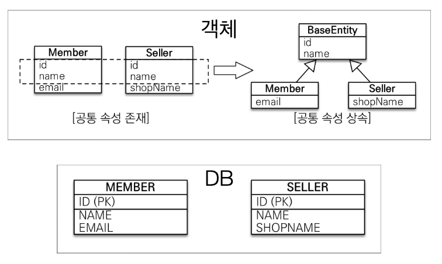
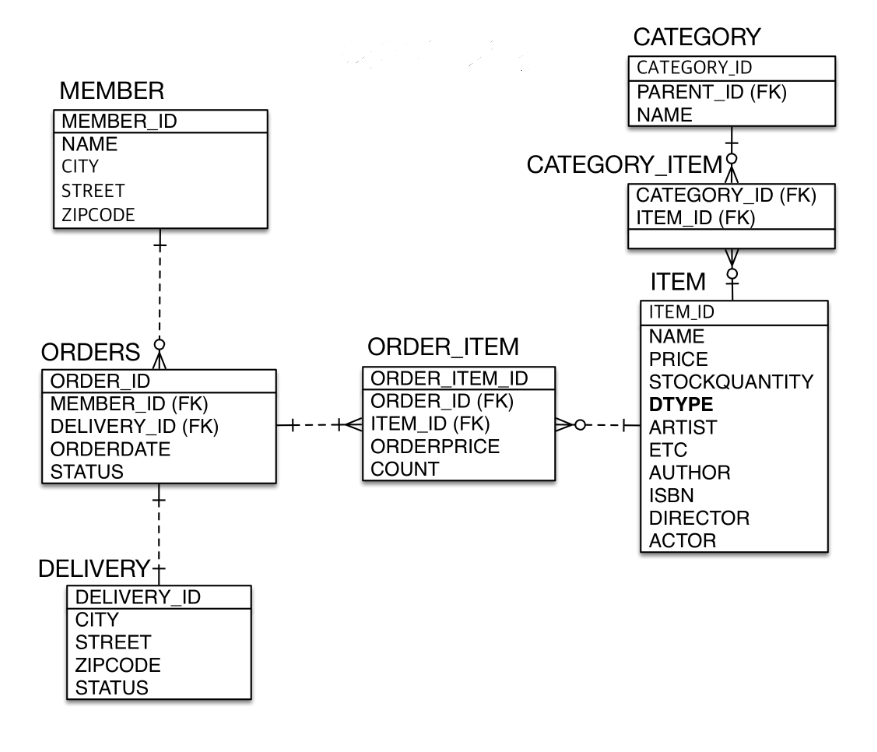

[목록으로 가기](./%EC%9E%90%EB%B0%94%20ORM%20%ED%91%9C%EC%A4%80%20JPA%20%ED%94%84%EB%A1%9C%EA%B7%B8%EB%9E%98%EB%B0%8D%20-%20%EA%B8%B0%EB%B3%B8%ED%8E%B8.html)
[강의자료](../../../../../attachments/jpa_basic/07.%20%EA%B3%A0%EA%B8%89%20%EB%A7%A4%ED%95%91.pdf)

## 고급 매핑
### 상속관계 매핑
#### 상속관계 매핑
|            슈퍼타입-서브타입 논리 모델            |                      상속관계 매핑 방법                      |
| :--------------------------------------------------: | :----------------------------------------------------------: |
|  | 조인 전략 단일 테이블 전략 구현 클래스마다 테이블 전략 |
 

- 객체의 상속 구조와 DB의 슈퍼타입 - 서브타입 관계를 매핑하는 것
- RDBMS는 상속관계를 나타낼 수 없음
- 슈퍼타입 - 서브타입 관계라는 모델링 기법이 객체 상속과 유사
- 슈퍼타입 - 서브타입 논리 모델을 실제 물리 모델로 구현하는 방법
  - 조인 전략 : 각각의 테이블로 변환
  - 단일 테이블 전략 : 하나의 통합 테이블로 변환
  - 구현 클래스마다 테이블 전략 : 서브타입 테이블로 변환
 

#### 주요 애노테이션
- `@Inheritance(strategy = InheritanceType.XXX)`
  - JOINED : 조인 전략
  - SINGLE_TABLE : 단일 테이블 전략
  - TABLE_PER_CLASS : 구현 클래스마다 테이블 전략
 

- `@DiscriminatorColumn(name = "DTYPE")`
- `@DiscriminatorValue("XXX)`
 

#### 조인 전략

- INSERT 시 각각의 테이블에 INSERT
- 조회 시 두 테이블을 조인하여 SELECT
- 비즈니스적으로 복잡하고 중요하거나, 변경 가능성이 있다면 채택
- 슈퍼타입 클래스에 `@DiscriminatorColumn`를 사용할 것을 권장
  - 수행되는 작업이 어떤 서브타입 테이블에 관련된 작업인지 구분하기 위해 사용할 컬럼을 만듦
  - 서브타입 클래스에 `@DiscriminatorValue`로 들어갈 값을 설정할 수 있음
 

- 장점
  - 정규화된 테이블, 저장공간의 효율화
  - 외래 키 참조 무결성 제약조건 사용 가능
    - 다른 테이블에서 슈퍼타입 테이블의 기본 키를 외래 키로 사용하는 경우에 유리
 

- 단점
  - 조회 시 조인이 많아 성능이 저하
  - 조회 쿼리가 복잡함
  - 데이터 저장 시 INSERT SQL 2번 호출
 

#### 단일 테이블 전략

- 규모가 작은 프로젝트에서 사용
- 단순하고 이후 확장 가능성이 적은 경우에 채택
- 하나의 테이블에 모든 서브타입 테이블을 포함시키고, DTYPE으로 구분
  - **DTYPE이 필수**; `@DiscriminatorColumn`을 설정하지 않아도 DTYPE이 자동 생성됨
 

- 성능상의 이점 : 한 테이블에만 INSERT하면 되고, 조회 시에도 조인할 필요가 없음
 

- 장점
  - 조인이 필요 없으므로 일반적으로 조회 성능이 빠름
  - 조회 쿼리가 단순함
 

- 단점
  - 자식 엔티티가 매핑한 컬럼은 모두 **nullable**
  - 단일 테이블에 모든 데이터를 저장하므로 테이블이 커질 수 있음
    - 상황에 따라 조회 성능이 저하되는 원인이 될 수 있음
 

#### 구현 클래스마다 테이블 전략

- ~~***쓰지마세요***~~
- 서브타입 테이블을 구분할 필요가 없어, 엔티티 클래스에 `@DiscriminatorColumn`을 설정해도 무시됨
- 만약 슈퍼타입 클래스로 조회를 시도하면, 모든 서브타입 테이블에서 확인해야 하므로 전부 UNION하여 조회하게 됨
- 장점
  - 서브 타입을 명확하게 구분해서 처리할 때 효과적
  - NOT NULL 제약조건 사용 가능
 

- 단점
  - 여러 자식 테이블을 함께 조회할 때 성능이 느림(UNION)
  - 자식 테이블을 통합해서 쿼리하기 어려움
  - 시스템에 변경사항이 생길 때 조치하기 힘듦
 

---
### Mapped Superclass - 매핑 정보 상속
#### @MappedSuperClass

- 공통 매핑 정보가 필요할 때 사용
  - 전체 엔티티에서 공통으로 적용하는 정보를 모을 때 사용(등록자, 등록일 등)
- **DB 설계와는 무관**하게, 사용 빈도가 높은 객체의 공통 속성을 상속해서 쓰고자 할 때 사용할 수 있음
  - 단순히 엔티티가 공통으로 사용하는 매핑 정보를 모으는 역할
 

#### 특징
- ***상속관계 매핑이 아님***
- ***엔티티가 아님***. 따라서 테이블과 매핑되지 않음
- 상속받는 자식 클래스에 컬럼 매핑 정보만 제공
- 조회. 검색할 수 없음
- 직접 생성해서 사용하는 클래스가 아니므로 **abstract** 권장
 

#### cf.
- JPA에서 엔티티 클래스가 상속할 수 있는 경우는 단 **두 경우**
  1. `@Entity` : 상속관계 매핑
  2. `@MappedSuperClass` : 속성만 매핑
 

---
### 실전 예제 4 - 상속관계 매핑
#### 요구사항 추가
- 상품의 종류는 음반, 도서, 영화가 있고, 이후 더 확장될 수 있음
- 모든 데이터는 등록일과 수정일이 필수
 

#### 설계
|                |                                                      |
| :------------: | :--------------------------------------------------: |
| 도메인 모델 |  |
| 도메인 상세 |  |
| 테이블 설계 |  |
- 단일 테이블 전략으로 음반, 도서, 영화 추가
- BaseEntity 클래스를 `@MappedSuperClass` 클래스로 공통 속성 매핑
 

