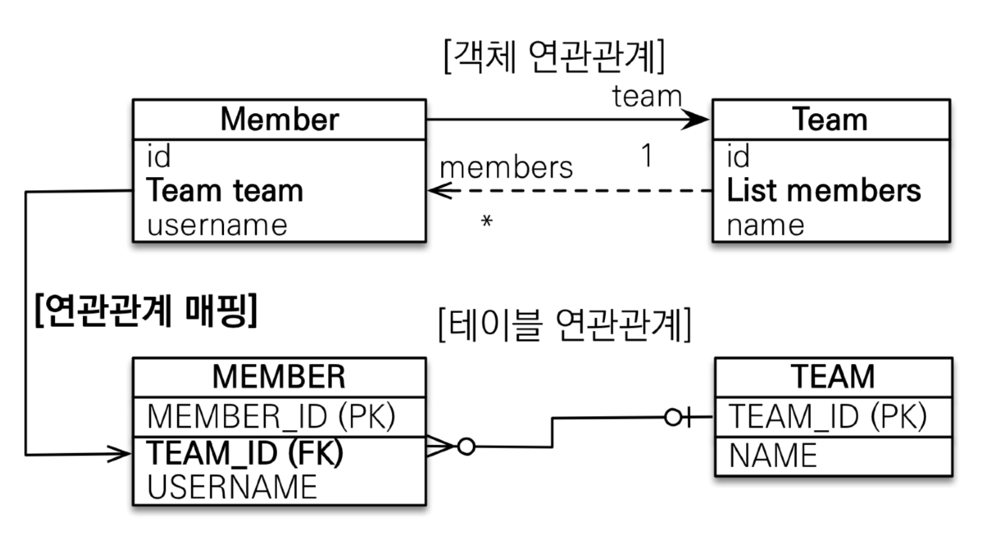
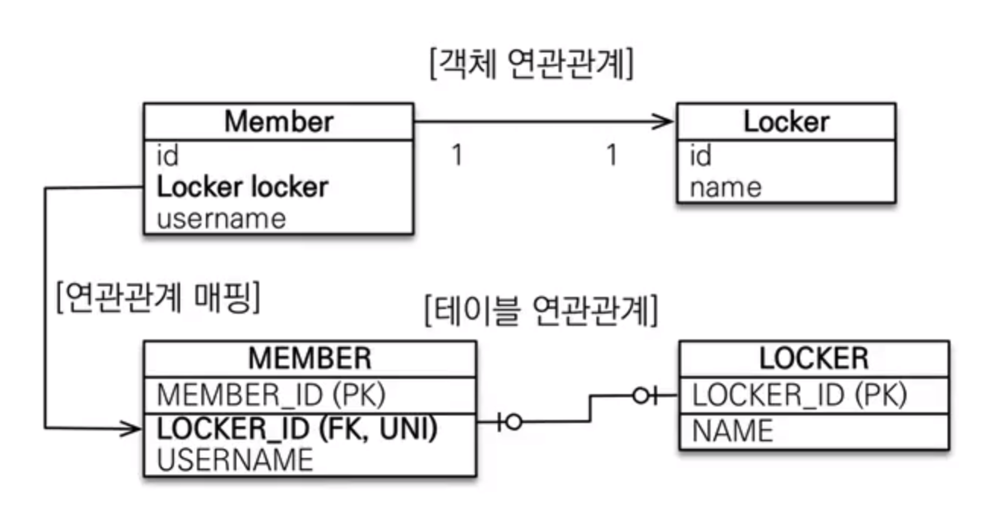
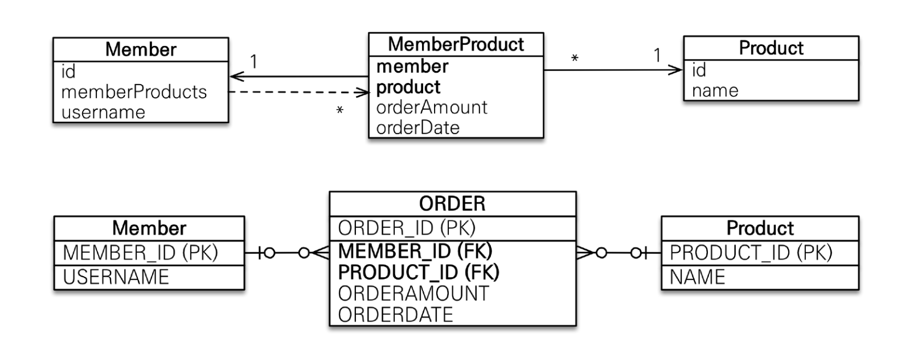
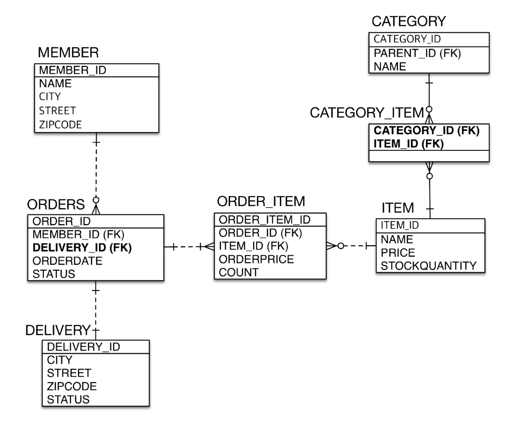

[목록으로 가기](./%EC%9E%90%EB%B0%94%20ORM%20%ED%91%9C%EC%A4%80%20JPA%20%ED%94%84%EB%A1%9C%EA%B7%B8%EB%9E%98%EB%B0%8D%20-%20%EA%B8%B0%EB%B3%B8%ED%8E%B8.html)
[강의자료](../../../../../attachments/jpa_basic/06.%20%EB%8B%A4%EC%96%91%ED%95%9C%20%EC%97%B0%EA%B4%80%EA%B4%80%EA%B3%84%20%EB%A7%A4%ED%95%91.pdf)

## 다양한 연관관계 매핑
### 다대일 [N:1]
#### 연관관계 매핑 시 고려사항 3가지
- 다중성
  - `@ManyToOne` / `@OneToMany` / `@OneToOne` / `@ManyToMany`
  - `@ManyToMany`는 거의 쓰이지 않음
<br>

- 단방향, 양방향
  |          테이블          |                     객체                     |
  | :----------------------: | :------------------------------------------: |
  | 외래 키 하나로 양쪽 join |       참조용 필드가 있는 쪽으로만 참조       |
  |      방향 개념 없음      | 한쪽만 참조하면 단방향, 서로 참조하면 양방향 |
<br>

- 연관관계의 주인
  - 외래 키를 관리하는 참조
  - 테이블은 **외래 키 하나**로 두 테이블이 연관관계를 맺음
  - 객체의 양방향 관계는 사실 **단방향 2개**
  - 따라서 참조도 2군데가 있어 둘 중 ***테이블의 외래 키를 관리할 곳을 지정해야함***
  - 주인의 반대편은 외래 키에 영향을 주지 않고, **단순 조회만** 가능
<br>

#### 다대일 단방향

- 가장 많이 사용
- 다대일의 반대는 일대다
<br>

#### 다대일 양방향

- Team에 `List<Member>` 추가
- 단, DB에는 전혀 영향을 주지 않고, 조회만 가능
- 외래 키가 있는 쪽이 연관관계의 주인
- 양쪽을 서로 참조하도록 개발
<br>

---
### 일대다 [1:N]
#### 일대다 단방향

- DB에서는 무조건 Many 쪽(MEMBER)에 외래 키가 있음
- Team(One 쪽)에 연관관계의 주인이 설정될 경우
  ```
  Team team = new Team();
  team.getMembers().add(member);
  em.persist(team);
  ```
  - member를 추가하기 위해서 MEMBER 테이블에 UPDATE 쿼리가 추가로 필요
  - Team 엔티티를 다루는데 MEMBER 테이블에 SQL이 실행됨; 의도하지 않은 엔티티에서 변경이 일어날 수 있음
  <br>

- 객체와 테이블의 차이 때문에 반대편 테이블의 외래 키를 관리하는 특이한 구조
- `@JoinColumn`을 반드시 사용해야 함
  - 사용하지 않으면 조인 테이블 방식 사용(중간 테이블 추가)
  <br>

- 권장되지는 않음
  - 엔티티가 관리하는 외래 키가 다른 테이블에 있음
  - 연관관계 관리를 위해 추가로 UPDATE SQL 실행
  - 일대다 단방향 보다는 **다대일 양방향 매핑** 권장
<br>

#### 일대다 양방향

- 야매 매핑
- `@JoinColumn(insertable = false, updatable = false)`
- **읽기 전용 필드**를 사용해서 양방향처럼 사용
- **다대일 양방향 매핑** 권장
<br>

---
### 일대일 [1:1]
#### 일대일 관계
- 주 테이블이나 대상 테이블 중 택1하여 외래 키 관리
- 외래 키에 데이터베이스 유니크 제약조건 추가 
<br>

#### 일대일 : 주 테이블에 외래 키 단방향

- 다대일 단방향 매핑과 유사
<br>

#### 일대일 : 주 테이블에 외래 키 양방향

- 다대일 양방향 매핑처럼 외래 키가 있는 곳이 연관관계의 주인
- 반대편은 mappedBy 적용
<br>

#### 일대일 : 대상 테이블에 외래 키 단방향

- 단방향 관계는 지원하지 않음
- 양방향 관계는 지원
<br>

#### 일대일 : 대상 테이블에 외래 키 양방향

- 일대일 주 테이블에 외래 키 양방향 매핑 방법과 동일
<br>

#### 정리
- 주 테이블에 외래 키
  - 주 객체가 대상 객체의 참조를 가짐 == 주 테이블에 외래 키를 두고 대상 테이블을 찾음
  - 객체지향 개발자가 선호
  - JPA 매핑 관리
  - 장점 : 주 테이블만 조회해도 대상 테이블에 데이터가 있는지 확인 가능
  - 단점 : 값이 없으면 외래 키에 null 허용
<br>

- 대상 테이블에 외래 키
  - 대상 테이블에 외래 키가 존재
  - 전통적인 DB 개발자가 선호
  - 장점 : 주 테이블과 대상 테이블을 일대일에서 일대다 관계로 변경할 때 테이블 구조 유지
  - 단점 : 프록시 기능의 한계로 **지연 로딩으로 설정해도 항상 즉시 로딩됨**
<br>

---
### 다대다 [N:M]
#### RDMBS의 다대다

- 정규화된 테이블 2개로 다대다 관계를 표현할 수 없음
- 연결 테이블을 추가해서 일대다, 다대일 관계로 풀어내야 함
<br>

#### 객체의 다대다

- 객체는 컬렉션을 사용해서 객체 2개로 다대다 관계 가능
<br>

#### 다대다 매핑
- `@ManyToMany` 사용
- `@JoinTable`로 연결 테이블 지정
  ```
  // class Category(주 테이블)
  @ManyToMany
  @JoinTable(name = "category_item",
               joinColumns = @JoinColumn(name = "category_id"),
               inverseJoinColumns = @JoinColumn(name = "item_id"))
  private List<Category> items;

  // class Item(대상 테이블)
  @ManyToMany(mappedBy = "items")
  List<Category> categories = new ArrayList<>();
  ```
- 단방향, 양방향 가능
<br>

#### 다대다 매핑의 한계
- 조회 시 연결 연결 테이블이 숨겨져 있기 때문에 쿼리를 예측하기 힘들어짐
- 실제 비즈니스에서는 연결 테이블이 단순하게 연결만 하고 끝나지 않음
  - 주문시간, 수량 같은 데이터가 들어올 수 있음
  - 매핑 정보만 들어오고 추가 정보를 사용할 수 없음
<br>

#### 한계 극복

- 연결 테이블용 엔티티 추가(= 연결 테이블을 엔티티로 승격)
- `@ManyToMany` -> `@OneToMany`, `@ManyToOne`
- 이 때, 연결 테이블의 기본 키는 각 테이블의 외래 키 2개의 복합 키로 사용하기보다는 **인공 키를 사용**할 것을 권장
  - 차후 변경이 생길 경우 PK가 종속되어 있으면 테이블 수정의 규모가 커질 수 있기 때문
<br>

---
### 실전 예제 3 - 다양한 연관관계 매핑
#### 엔티티

- 배송, 카테고리 추가
- 주문과 배송은 1:1
- 상품과 카테고리는 N:M
<br>

#### ERD

- 주문(주 테이블) 에서 외래 키를 관리
- 카테고리 - 상품의 다대다 관계는 권장하지 않지만 예시를 위해 다대다 매핑
  - 필드를 추가할 수 없고, 엔티티와 테이블이 불일치함
<br>

#### `@JoinColumn`
- 외래 키를 매핑할 때 사용
  |         속성          |                                설명                                 |                   기본값                   |
  | :-------------------: | :-----------------------------------------------------------------: | :----------------------------------------: |
  |         name          |                         매핑할 외래 키 이름                         |  필드명_참조하는 테이블의 기본 키 컬럼명   |
  | referencedColumnName  |               외래 키가 참조하는 대상 테이블의 컬럼명               |      참조하는 테이블의 기본 키 컬럼명      |
  |    foreignKey(DDL)    |       외래 키 제약조건을 직접 지정<br>테이블 생성 시에만 사용       |                                            |
  |      unique(DDL)      |                    컬럼에 유니크 제약조건을 지정                    |                   false                    |
  |     nullable(DDL)     |           false로 설정 시 컬럼에 NOT NULL 제약조건을 지정           |                    true                    |
  |      insertable       |  읽기 전용에서 사용<br>false 설정 시 이 필드를 DB에 저장하지 않음   |                    true                    |
  |       updatable       | 읽기 전용에서 사용<br>false 설정 시 이 필드를 DB에서 수정하지 않음  |                    true                    |
  | columnDefinition(DDL) |                 데이터베이스 컬럼 정보를 직접 지정                  | 자바 필드 타입, dialect 정보를 참고해 생성 |
  |         table         | [링크 참고](https://www.objectdb.com/api/java/jpa/JoinColumn/table) |        현재 클래스가 매핑된 테이블         |

  - ***!주의*** 외래 키 제약조건을 매핑하는 것이 아님
  <br>

#### `@ManyToOne`
- 다대일 관계 매핑
  |     속성     |                          설명                          |                             기본값                              |
  | :----------: | :----------------------------------------------------: | :-------------------------------------------------------------: |
  |   optional   |      false 설정 시 연관된 엔티티가 항상 있어야 함      |                              true                               |
  |    fetch     |                글로벌 페치 전략을 설정                 | `@ManyToOne = FetchType.EAGER`<br>`@OneToMany = FetchType.LAZY` |
  |   cascade    |                영속성 전이 기능을 사용                 |                                                                 |
  | targetEntity | 연관된 엔티티의 타입 정보를 설정<br>거의 사용하지 않음 |                                                                 |
  - 다대일에는 mappedBy 속성이 없음; **연관관계의 주인이 되야 함**
<br>

#### `@OneToMany`
- 일대다 관계 매핑
  |     속성     |                          설명                          |                             기본값                              |
  | :----------: | :----------------------------------------------------: | :-------------------------------------------------------------: |
  |   mappedBy   |             연관관계의 주인인 필드를 지정              |                                                                 |
  |    fetch     |                글로벌 페치 전략을 설정                 | `@ManyToOne = FetchType.EAGER`<br>`@OneToMany = FetchType.LAZY` |
  |   cascade    |                영속성 전이 기능을 사용                 |                                                                 |
  | targetEntity | 연관된 엔티티의 타입 정보를 설정<br>거의 사용하지 않음 |                                                                 |
<br>

