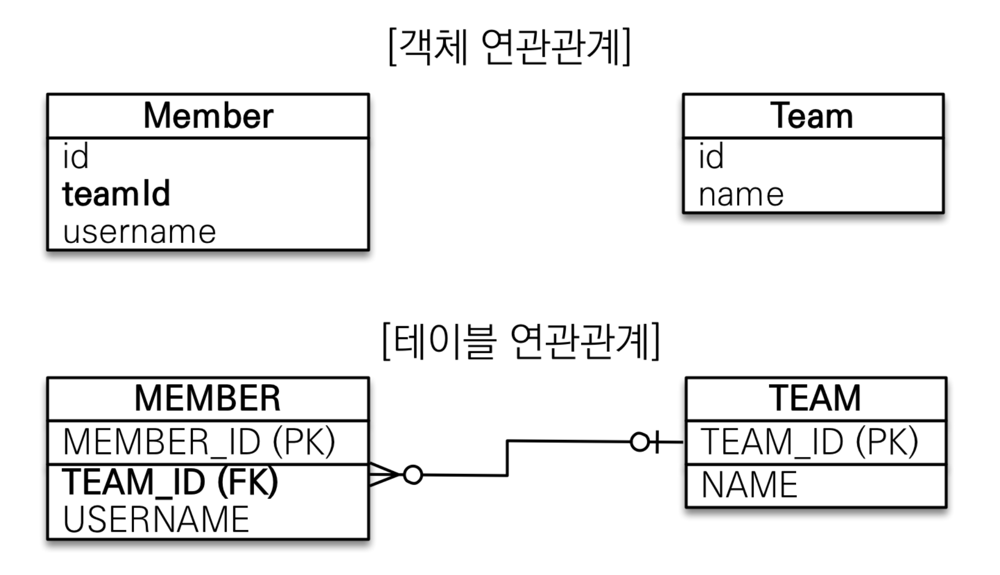
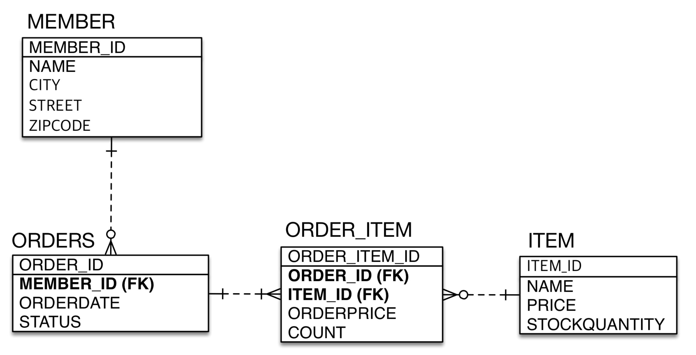

[목록으로 가기](./%EC%9E%90%EB%B0%94%20ORM%20%ED%91%9C%EC%A4%80%20JPA%20%ED%94%84%EB%A1%9C%EA%B7%B8%EB%9E%98%EB%B0%8D%20-%20%EA%B8%B0%EB%B3%B8%ED%8E%B8.html)
[강의자료](../../../../../attachments/jpa_basic/05.%20%EC%97%B0%EA%B4%80%EA%B4%80%EA%B3%84%20%EB%A7%A4%ED%95%91%20%EA%B8%B0%EC%B4%88.pdf)

## 연관관계 매핑 기초
### 단방향 연관관계
#### 용어 이해
- 방향(dirction) : 단방향, 양방향
- 다중성(multiplicity) : 다대일, 일대다, 일대일, 다대다
- **연관관계의 주인(owner)** : 객체 양방향 관계는 관리 주인이 필요
<br>

#### 예제 시나리오
- 회원과 팀이 있음
- 회원은 하나의 팀에만 소속됨
- 회원과 팀은 다대일
<br>

#### 객체를 테이블에 맞추어 모델링(데이터 중심)

- 객체에 연관관계가 없음
- Member 객체에 외래 키 값을 그대로 가져옴
- 문제점
  - member를 persist 하기 위해서는 team을 조회해서 id를 가져온 뒤 member에 set 해줘야 함
  - member의 team을 조회하기 위해서는 member의 teamId를 가져와서 다시 team을 조회해야 함
  - 테이블은 외래 키로 조인해서 연관 테이블을 찾고, 객체는 참조를 사용해서 연관된 객체를 찾는 차이가 있기 때문
<br>

#### 객체 지향 모델링(단방향 연관관계)

- member 객체에서 team을 바로 가져올 수 있음
<br>

---
### 양방향 연관관계와 연관관계의 주인 1 - 기본
#### 양방향 매핑

- Team <-> Member(List) 양방향으로 객체 그래프 탐색 가능
- Member는 단방향 매핑과 동일하게 작성
- Team에 `List<Member> members` 필드를 추가
  - `@OneToMany(mappedBy = "team")` 애노테이션 필요
<br>

#### 객체와 테이블이 관계를 맺는 차이
- 객체 연관관계 : 2개
  - 회원 -> 팀 (단방향)
  - 팀 -> 회원 (단방향)
  - 객체의 양방향 연관관계는 **사실상 2개의 단방향 관계**
    - 던방향 매핑에서 반대방향으로 조회(객체 그래프 탐색))하는 기능만 추가
  - 객체를 양방향으로 참조하려면 **단방향 연관관계 2개**가 필요
<br>

- 테이블 연관관계 : 1개
  - 회원 <-> 팀 (양방향)
  - **외래 키 하나**로 양방향 연관관계를 가짐
<br>

#### 딜레마 : 둘 중 하나로 외래 키를 관리해야 한다

- 회원의 팀 정보가 변경될 때 (= 팀의 회원목록이 바뀔 때)
- DB에서 MEMBER 테이블의 외래 키(TEAM_ID)는 어떤 기준으로 UPDATE 해야 하는가? 
  = Member, Team 객체 중 어디에서 외래 키를 관리해야 하는가?
    1. Member의 team을 변경
    2. Team의 members를 변경
  - 사실 둘 다 가능
<br>

#### 연관관계의 주인(Owner)
- 양방향 매핑 규칙
  - 객체의 두 관계 중 하나를 연관관계의 주인으로 지정
  - 연관관계의 주인만 외래 키를 관리(등록, 수정)
  - 주인이 아닌 쪽은 읽기만 가능
  - 주인은 mappedBy 속성 지정 안함
  - 주인이 아닌 객체는 mappedBy 속성으로 주인을 지정
  <br>

#### 누구를 주인으로? (가이드)
- 외래 키가 있는 곳을 주인으로 정해라(= N:1 관계에서 N 쪽)
- 예시
  - 자동차(Car.wheels) - 바퀴 관계에서 바퀴(Wheel.car)에 주인을 설정
  - 이 경우에는 Member.team이 연관관계의 주인이 됨
  - Team.members를 주인으로 설정한다면?
    - 가능(JPA 짬킹 한정)
    - Team을 다뤘는데 MEMBER 테이블의 UPDATE 쿼리가 나가는 등의 문제의 소지가 있음(성능 이슈)
  <br>

- 연관관계의 주인은 비즈니스적으로 중요한 개념은 아님
<br>

---
### 양방향 연관관계와 연관관계의 주인 2 - 주의점, 정리
#### 연관관계의 주인에 값을 입력하지 않음
```
Team team = new Team();
team.setName("teamA");
team.getMembers().add(member);
em.persist(team);

Member member = new Member();
member.setUsername("member1");
em.persist(member);

em.flush();
em.clear();

tx.commit();
```
- `team.getMembers().add()` 로 Member를 리스트에 추가해도 DB에는 MEMBER의 TEAM_ID에 FK가 들어가지 않음 (1)
- `member.setTeam()` 으로 Member에서 Team을 참조해야 MEMBER테이블에도 정상적으로 반영됨 (2)
    ∵ 연관관계의 주인은 Member이기 때문에, (1)은 DB에 영향을 주지 못함 
  <br>

- (1)을 하지 않더라도 JPA는 지연 로딩을 통해 연관된 Member의 목록을 조회할 수 있음
  - 단, **flush 되지 않고 1차 캐시에서 팀을 가져올 경우** DB에서 조회하지 않기 때문에 추가한 Member가 `getMembers()`에서 조회되지 않을 수 있음
<br>

- 객체 관계를 고려하면 (1), (2) 모두 해주는 것이 맞음
  - 하나만 하고 까먹기 쉽기 때문에 **연관관계 편의 메서드**를 만들어 사용 권장
  - `Team.addMember(Member member)` 또는 `Member.changeTeam(Team team)` 등 상황에 따라 택1
<br>

#### 양방향 매핑 시 무한 루프 주의
- `toString()`, lombok, JSON 생성 라이브러리
- 두 객체가 서로 참조할 때, `toString()`에서 참조하는 객체가 다시 `toString()`을 호출하는 경우
- JSON 생성 라이브러리에서는 **엔티티를 반환하지 말 것**
  - DTO로 변환해서 반환하는 것을 권장
<br>

---
### 실전 예제 2 - 연관관계 매핑 시작
#### 테이블 구조

<br>

#### 객체 구조

- 참조를 사용하도록 변경
<br>

#### 매핑
- 단방향 관계를 우선적으로 매핑, 이후 필요 시 양방향 매핑
- 외래 키를 가진 객체에서 연관관계의 주인을 설정(`@JoinColumn`)
- 외래 키를 필드로 가지지 않고, 객체를 필드로 가짐
<br>

#### 설계
- 회원의 주문 목록을 가져올 경우
  - ORDER에서 MEMBER_ID를 이용해 조회하는 것이 자연스러움
  - Member에서  `List<Order>`로 주문 목록을 가져오고 있다면, 관심사를 제대로 끊어내지 못한 것일 수 있음
  <br> 

- 주문은 연관된 상품 목록을 필요로 할 확률이 높음
  - 비즈니스적으로 의미가 클 수 있으므로 양방향 매핑
  <br>

- Member.orders, Order.orderItems는 없어도 문제 없음
  - 단방향으로도 테이블 간 매핑은 완성되었기 때문
  - 개발상의 편의, 일괄 조회 등이 필요할 때 사용(JPQL 등)
<br>

