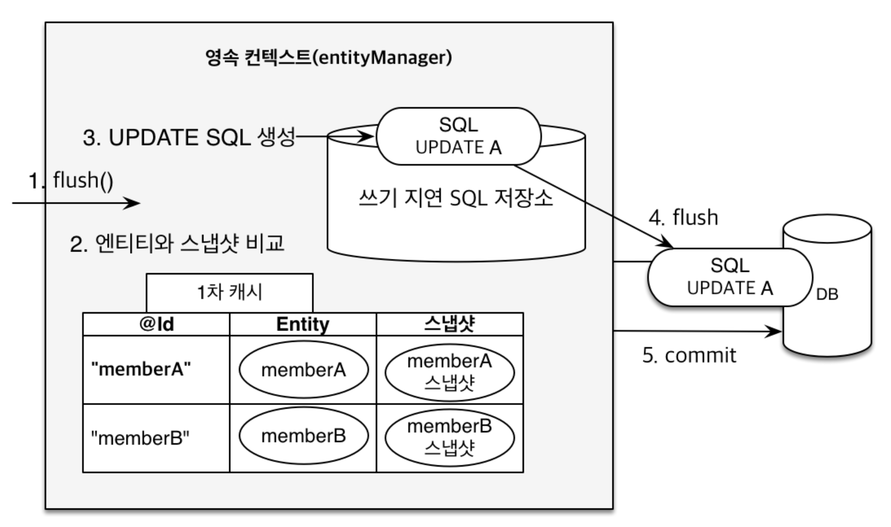

[목록으로 가기](./%EC%9E%90%EB%B0%94%20ORM%20%ED%91%9C%EC%A4%80%20JPA%20%ED%94%84%EB%A1%9C%EA%B7%B8%EB%9E%98%EB%B0%8D%20-%20%EA%B8%B0%EB%B3%B8%ED%8E%B8.html)
[강의자료](../../../../../attachments/jpa_basic/03.%20%EC%98%81%EC%86%8D%EC%84%B1%20%EA%B4%80%EB%A6%AC.pdf)

## **영속성 관리 - 내부 동작 방식**
### 영속성 컨텍스트 1
#### **영속성 컨텍스트**
  - 엔티티를 영구 저장하는 환경(논리적 개념)
  - em을 통해서 영속성 컨텍스트에 접근
  - `em.persist(entity);`
<br>

#### 엔티티의 생명주기
```
Member member = new Member();
member.setId("member1");
member.setName("memberA");    // 비영속

em.getTransaction().begin();
em.persist(member);           // 영속
em.detach(member);            // 준영속
```
- 비영속 (new / transient)
- 영속 (managed)
- 준영속 (detached)
- 삭제 (removed)
<br>

---
### 영속성 컨텍스트 2

#### 엔티티 조회, 1차 캐시
  - 1차 캐시

    |    @Id    | Entity |
    | :-------: | :----: |
    | "member1" | member |

  - `em.find(Member.class, "member1");`
    1. 1차 캐시에서 조회 -> 조회 결과 존재
    2. 조회 결과를 반환
    <br>
    
  - `em.find(Member.class, "member2");`
    1. 1차 캐시에서 조회 -> 조회 결과 없음
    2. DB 조회
    3. DB 조회 결과를 1차 캐시에 저장
    4. 조회 결과를 반환
    <br>

  - 1차 캐시의 성능적 이익은 크지 않음
    - em은 보통 트랜잭션 단위로 존재하고, 요청이 종료 될 때 같이 종료; 1차 캐시도 삭제
    - 하나의 트랜잭션 안에서만 이익을 볼 수 있는 구조
    - JPA(또는 Hibernate)에서 애플리케이션 전쳉에서 공유하는 캐시는 2차 캐시라 함
<br>

#### 영속 엔티티의 동일성 보장
```
Member a = em.find(Member.class, "member1");
Member b = em.find(Member.class, "member1");

System.out.println(a == b); // true
```
- 1차 캐시를 이용하여 같은 참조를 가진 객체처럼 비교
- 반복 가능한 읽기(REPEATABLE READ) 등급의 트랜잭션 격리 수준을 DB가 아닌 애플리케이션에서 제공
<br>

#### 엔티티 등록
- 트랜잭션을 지원하는 쓰기 지연
  |                    `em.persist()`                    |                    `tx.commit()`                     |
  | :--------------------------------------------------: | :--------------------------------------------------: |
  |  |  |
    - `em.persist()` 때 SQL을 생성해서 쓰기 지연 SQL 저장소에 보관
    - 트랜잭션 commit 직전에 SQL을 flush(DB로 전송)하고 DB에서 commit
    - 예외의 경우가 존재함 (`GenerationType.SEQUENCE)`
    - 버퍼링 가능 : Hibernate의 경우 hibernate.jdbc.batch.size 옵션에서 설정한 만큼 쿼리를 보내고 DB commit
<br>

#### 엔티티 수정
- 변경 감지(dirty checking)
  
  - 스냅샷 : 엔티티를 읽어온 최초 시점의 상태를 보관한 것
  - `em.flush()` 할 때(트랜잭션 커밋 시점) 엔티티와 스냅샷을 비교
  - 만약 엔티티와 스냅샷에 차이가 있다면 쓰기 지연 SQL 저장소에 UPDATE 쿼리 추가
<br>

#### 엔티티 삭제
- `em.remove(entity)`로 삭제 
- 같은 방식으로 쓰기 지연 SQL 저장소에 DELETE 쿼리 생성 후 flush
<br>

---
### 플러시
#### 정의 : 영속성 컨텍스트의 변경 내용을 DB에 반영하는 것
<br>

#### 트랜잭션 commit 시 플러시 발생
- 변경 감지
- 변경 감지한 결과로 수정된 엔티티에 대한 UPDATE 쿼리를 쓰기 지연 SQL 저장소에 등록
- 쓰기 지연 SQL 저장소의 쿼리(등록, 수정, 삭제)를 DB에 전송
<br>

#### 플러시 하는 방법
- `em.flush()`
  - 직접 호출
  - 커밋 전 미리 DB에 반영, 전송되는 쿼리 확인, 테스트 용도로 강제 호출해서 사용
  - 플러시 한다고 해서 1차 캐시가 지워지는 것은 아님
- 트랜잭션 커밋 : 플러시 자동 호출
- JPQL 쿼리 실행
  - 플러시 자동 호출
  - JPQL은 즉시 DB에서 실행되기 때문에 실행 전 영속성 컨텍스트의 상태를 DB에 동기화하기 위함
  - ex) `em.persist(memberC)` 호출 후 JPQL로 전체 회원을 조회한다면, DB에서 INSERT가 실행되어야 memberC의 정보도 조회할 수 있음
<br>

#### 플러시 모드 옵션 : `em.setFlushMode(FlushModeType flushModeType)`
- FlushModeType.AUTO : 커밋이나 쿼리를 실행할 때 플러시(default)
- FlushModeType.COMMIT : 커밋할 때만 플러시
<br>

#### **!주의**
- 플러시는 ***영속성 컨텍스트를 비우지 않음***
- 영속성 컨텍스트의 **변경내용을 DB에 동기화**
- 트랜잭션이라는 작업 단위가 중요하므로, 커밋 직전에만 동기화하면 됨
<br>

---
### 준영속 상태
#### 준영속 상태로 만드는 방법
- `em.detach(entity)` : 특정 엔티티를 준영속 상태로 전환
- `em.clear()` : 영속성 컨텍스트를 초기화
- `em.close()` : 영속성 컨텍스트 종료
- 테스트 환경에서 사용, 단순한 로직에서는 사실상 필요 없음
<br>

---
### 정리
#### 걍 정리였음
<br>

