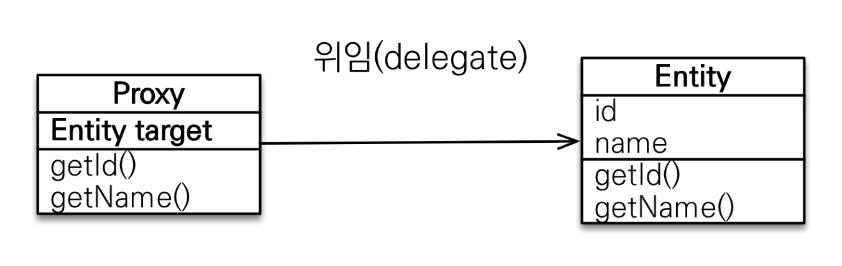
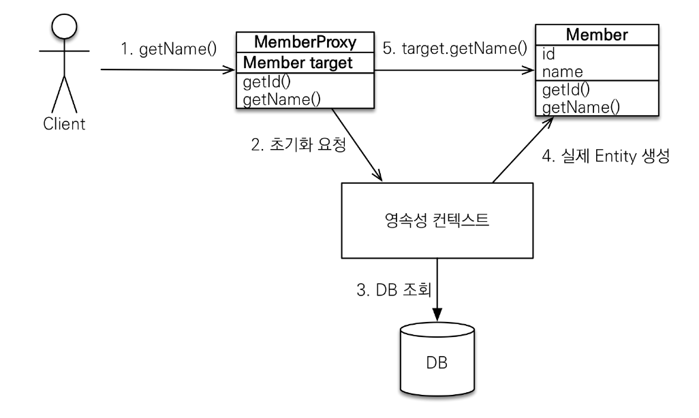
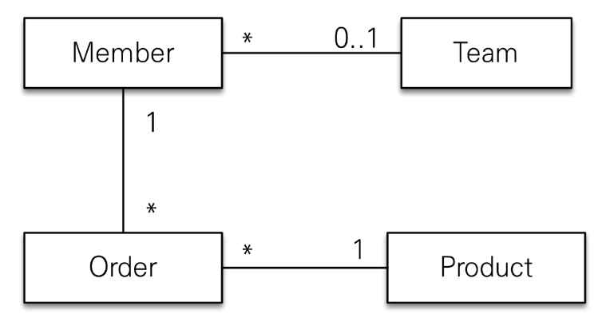
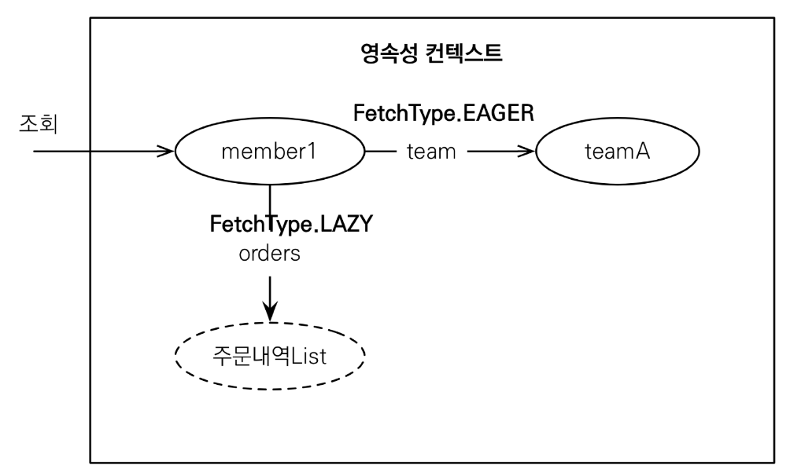
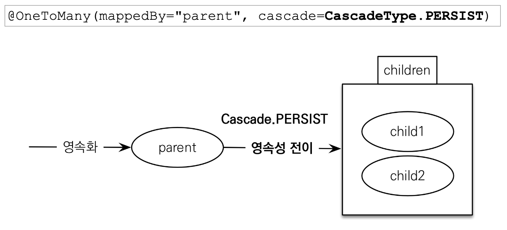

[목록으로 가기](./%EC%9E%90%EB%B0%94%20ORM%20%ED%91%9C%EC%A4%80%20JPA%20%ED%94%84%EB%A1%9C%EA%B7%B8%EB%9E%98%EB%B0%8D%20-%20%EA%B8%B0%EB%B3%B8%ED%8E%B8.html)
[강의자료](../../../../../attachments/jpa_basic/08.%20%ED%94%84%EB%A1%9D%EC%8B%9C%EC%99%80%20%EC%97%B0%EA%B4%80%EA%B4%80%EA%B3%84%20%EA%B4%80%EB%A6%AC.pdf)

## 프록시와 연관관계 정리
### 프록시
#### Member를 조회할 때 Team도 함께 조회해야 할까?
- 비즈니스 로직에 따라 Member의 정보만 필요하거나, Member와 Team의 정보가 함께 필요할 수 있음
  - 경우에 따라 모든 연관관계의 정보를 조회할 필요가 없음
<br>

#### 프록시 기초
- `em.find()` : **데이터베이스를 통해** 실제 엔티티 객체를 조회
- `em.getReference()`
  - DB 조회를 미루는 **가짜(프록시) 엔티티 객체 조회**
  - `em.getReference()` 시점에는 DB에 쿼리하지 않음
  - 정보가 필요해지는 시점에 조회
<br>

#### 프록시의 특징 1

- 실제 클래스를 **상속**받아서 만들어짐
- 실제 클래스와 겉모양이 같음
- 사용자는 진짜 객체와 프록시 객체의 구분 없이 사용하면 됨
- 실제 객체의 참조(target)를 보관함
- 프록시 객체를 호출하면 프록시 객체는 실제 객체의 메소드를 호출
<br>

#### 프록시 객체의 초기화

1. 프록시 객체의 메서드를 호출
2. target에 참조가 없다면 **영속성 컨텍스트에 초기화를 요청**
3. em은 DB에서 실제 객채를 조회
4. 실제 엔티티가 생성됨
5. 4에서 생성된 엔티티의 **참조를 프록시 객체에 할당**하고, 실제 객체의 메서드가 호출됨
- 프록시 초기화 매커니즘은 표준이 아니므로, 구현체 별로 다를 수 있음
<br>

#### 프록시의 특징 2
- 처음 사용되는 시점에 한 번만 초기화 됨
- 초기화 하면 **실제 엔티티로 교체되는 것이 아니라** 프록시 객체를 통해 실제 엔티티로 접근이 가능해짐 (1)
- 프록시 객체는 원본 엔티티를 상속받으므로 **타입 체크시 주의해야 함**
  - 프록시를 사용하는지, 실제 엔티티를 사용하는지 판단하기 어려움
  - == 비교 대신 `instance of` 를 사용할 것
  <br>

- 영속성 컨텍스트에 찾는 엔티티가 이미 있으면 `getReference()`를 호출해도 실제 엔티티가 반환됨 (2)
  - 이미 엔티티가 있는 상황에서 프록시를 반환해도 얻을 수 있는 이점이 없음
<br>

- 프록시 객체가 영속성 컨텍스트와 무관해질 경우(준영속 상태 or em 종료 등) 프록시 초기화를 시도하면 문제 발생
  - Hibernate는 org.hibernate.LazyInitializationException 예외 발생
<br>

- (1)과 (2)로 인해 **하나의 트랜잭션 내에서 같은 기본 키로 엔티티를 조회할 때 동일성을 보장**할 수 있게 됨
  - 프록시를 사용하든 실제 엔티티를 사용하든 문제가 생기지 않게 개발하는 것이 중요함
<br>

#### 프록시 확인
- 프록시 인스턴스 초기화 여부 확인
  - `PersistenceUnitUtil.isLoaded(Object entity)`
  - PersistenceUnitUtil은 emf에서 get
<br>

- 프록시 클래스 확인 방법
  - `entity.getClass().getName`으로 클래스명 확인
<br>

- 프록시 강제 초기화
  - `org.hibernate.Hibernate.initialize(entity)`
  - JPA 표준은 강제 초기화 할 수 없음; 임의로 엔티티의 메서드를 호출해 초기화 유도


<br>

___
### 즉시 로딩과 지연 로딩

#### Member를 조회할 때 Team도 함께 조회해야 할까?
- Team은 지연 로딩(Lazy Loading)을 사용해서 프록시로 조회
- `Team.getName()` 등으로 실제 team을 사용하는 시점에 초기화(DB조회)
  - 단순히 `Member.getTeam()` 하는 것으로는 DB에서 조회하지 않음
<br>

#### Member와 Team을 자주 함께 사용한다면?
- 즉시 로딩(`FetchType.Eager`)를 사용해서 Member와 Team을 함께 조회
<br>

#### ***!주의***
- ***가급적 지연 로딩만 사용할 것***
  - 특히 실무에서는 조인하는 테이블 갯수가 많을 수 있음
  <br>

- 즉시 로딩 적용 시 예상하지 못한 SQL이 발생할 수 있음
  - JPQL은 그대로 SQL로 번역되어 실행됨
  - Member만 조회해도 Member의 수 만큼 Team을 다시 조회 -> N+1 문제
  <br>
  
- 즉시 로딩은 JPQL에서 N+1 문제를 발생시킴
  - 1 : 최초 쿼리 / N : 추가 쿼리
  - fetch join, `@EntityGraph`, `@BatchSize` 등으로 해결
  <br>

- 일단 지연 로딩을 다 발라놓고 생각
  - `@ManyToOne`, `@OneToOne`은 즉시 로딩이 default이므로 지연로딩으로 설정
  - `@OneToMany`, `@ManyToMany`는 지연 로딩이 default
<br>

#### 지연 로딩 활용

- ~~실무에서는 다 지연 로딩으로 설정할 것~~
- Member와 Team은 자주 함께 사용 -> 즉시 로딩
- Member와 Order는 가끔 사용 -> 지연 로딩
- Order와 Product는 자주 함께 사용 -> 즉시 로딩
<br>


- member1 조회 시 주문내역List는 프록시로 조회
<br>


- 이후 member1에서 프록시를 건드릴 경우 주문과 상품을 함께 조회
<br>

#### 지연 로딩 활용 - 실무
- ***모든 연관관계에 지연 로딩을 사용***
  - JPQL fetch join이나 엔티티 그래프 기능을 사용할 것
  <br>

- ***실무에서 즉시 로딩을 사용하지 말 것***
  - 즉시 로딩은 쿼리를 예측하기 힘들 수 있음
<br>


<br>

---
### 영속성 전이(CASCADE)와 고아 객체

#### 영속성 전이 : CASCADE
- 특정 엔티티를 영속 상태로 만들 때 연관된 엔티티도 함께 영속 상태로 만들고 싶을 때
- ex) 부모 엔티티를 저장할 때 자식 엔티티도 함께 저장
  - ```
    Child child1 = new Child();
    Child child2 = new Child();

    Parent parent = new Parent();
    parent.addChild(child1);
    parent.addChild(child2);

    em.persist(parent);
    // em.persist(child1);
    // em.persist(child2);
    ```
  - Parent.childList에 `cascade = CascadeType.ALL`을 설정
  - Parent 객체에 추가해 두는 것 만으로도 Child까지 INSERT 쿼리가 생성됨
<br>

#### 영속성 전이 : 저장

- `em.persist(parent)` 할 때  Parent.children이 참조하고 있는 child1, child2도 함께 영속화 하겠다는 의미
<br>

#### CASECADE 종류
- **ALL : 모두 적용**
- **PERSIST : 영속**
- **REMOVE : 삭제**
- MERGE : 병합
- REFRESH : REFRESH
- DETACH : DETACH

#### ***!주의***
- 영속성 전이는 연관관계를 매핑하는 것과 아무 관련이 없음
- 앤티티 영속화 시 연관된 엔티티도 함께 영속화하는 편의 기능
- 사용할 수 있는 경우인지 판단해서 사용해야 함
  1. 두 엔티티의 생명주기가 같거나 거의 일치할 때
  2. 하나의 엔티티가 연관된 엔티티의 단일 소유자 일 때
<br>

#### 고아 객체
- 부모 엔티티와 연관관계가 끊어진 자식 엔티티
- **`orpahRemoval = true`**
  - 고아객체를 자동으로 삭제
  - 참조가 제거된 엔티티는 다른 곳에서 참조하지 않는다고 간주하고 삭제
  <br>

- `List.remove()` 등으로 연관관계가 끊어지면 DELETE 쿼리 생성
<br>

#### ***!주의***
- **특정 엔티티가 개인 소유할 때 사용**
- **참조하는 곳이 하나일 때 사용해야 함**
  - 참조 제거 시 다른 곳에서 참조하지 않는다고 간주하기 때문
  <br>

- 참고
  - 부모가 제거되면 자식이 고아가 되므로 **자식도 함께 제거**됨
  - 마치 `CascadeType.REMOVE` 처럼 동작
  <br>

#### 영속성 전이 + 고아 객체, 생명주기
- `cascade = CascadeType.ALL, orpahnRemoval = true`
- 직접 생명주기를 관리하는 엔티티는 `em.persist()`로 영속화, `em.remove()`로 제거
  - 두 옵션을 모두 활성화 하면, **부모 엔티티를 통해서 자식의 생명주기를 관리**할 수 있음
  <br>

- DDD의 Aggregate Root 개념 구현에 유용
  - ~~아 그렇구나~~~
<br>

___
### 실전 예제 5 - 연관관계 관리

#### 글로벌 fetch 전략 설정
- 모든 연관관계를 지연 로딩으로 설정
  - `@ManyToOne`, `@OneToOne`을 직접 지연 로딩으로 설정해야 함
<br>

#### 영속성 전이 설정
- Order -> Delivery : `CascadeType.ALL`
- Order -> OrderItem : `CascadeType.ALL`
<br>

